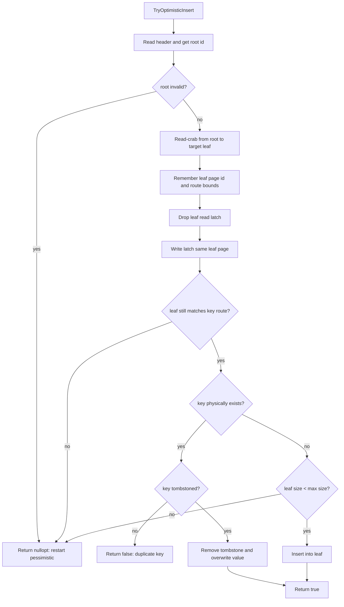
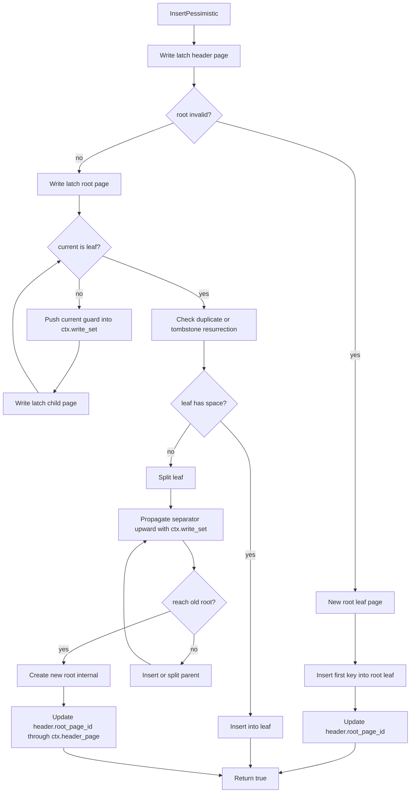
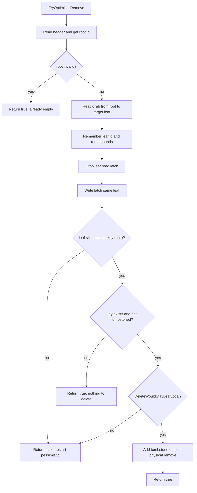
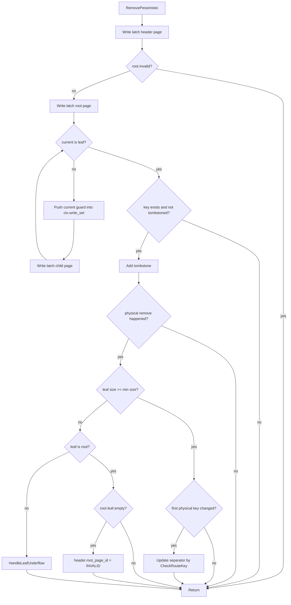

## Task1 B+树的页面类

你必须实现以下三个 Page 类来存储 B+ 树的数据。

1. **B+Tree Page (B+树基础页面)**
2. **B+Tree Internal Page (B+树内部页面)**
3. **B+Tree Leaf Page (B+树叶子页面)**

基本按照项目brief去写就行，同时2025Fall加入了墓碑缓存的机制。

墓碑缓存用来记录近期删除的缓冲区，存储LEAF_PAGE_TOMB_CNT个，当超出时，删除缓冲区最后一个元素

同时这里保存的是被"预约"删除的键的索引，直到这个索引在墓碑缓存中被删除，才会真正从叶子节点中移除。

在写Task1的时候我一直在想墓碑缓存什么时候触发，在B+树结构变化的时候墓碑缓存该做出什么操作，什么时候刷新，需不需要实现内部函数，这些都会在Task2实现。

需要注意的是：BPlusTreePage::GetMinSize()这个函数，ceil()与floor()的实现都是可以的，但是这个函数是给B+树提供分裂标准的，可以注意到采用ceil()与floor()会在后续产生不一样的效果，B+树的分裂合并的次数会不同。

二编：在跑Task2的数据时，如果叶子结点与内部节点同样定义为floor()会出现数组越界的问题，这个问题在问询ai后得到如下回复：

> **内部节点（K 个键，K 个指针）**：
>
> 内部节点的第一个 Key 往往是无效的（或仅作为占位符），因为它通过 $n$ 个指针划分出 $n$ 个区间，实际只需要 $n-1$ 个有效用于比较的 Key。
>
> 为了保证树的搜索效率对数级别不退化，内部节点的分支数不能太少。因此采用向上取整，确保即使在奇数容量下，也能维持一半以上的有效路由分支。
>
> **叶子节点（K 个键，K 个值）**：
>
> 叶子节点的每一个 Key 都是有效的，且与实际数据（或数据记录的 RecordId）一一对应。其核心目的是提供数据的高空间利用率，对分叉树的要求不如内部节点严格，因此采用向下取整即可满足半满（half-full）的要求。

不得不吐槽，写这个作业嵌套了一堆之前自己写的东西，真的是越写越晕。

## Task2 B+树的插入、删除逻辑

具体的逻辑可以从[B+树wiki](https://zh.wikipedia.org/wiki/B%2B%E6%A0%91#)中得到，也可以让ai帮忙总结自己写代码。这一段的书写真的是写完就让ai做一下code review...

### 插入逻辑如下:

```
Insert(key, value)
  │
  ├─ IsEmpty()? ─→ 创建根叶子页，插入 entry，更新 header_page.root_page_id_
  │
  └─ 非空：
      │
      ├─ 遍历到叶子页（和 GetValue 一样的路由逻辑，但用 WritePageGuard）
      │   沿途每层 push 到 ctx.write_set_
      │
      ├─ 检查 key 是否已存在（已存在且不在墓碑中 → return false）
      │
      ├─ 如果 key 在墓碑中：从墓碑中移除该条目（复活）
      │
      ├─ 在 key_array_ 中找到插入位置，后移元素，插入新 key-value
      │   SetSize(GetSize() + 1)
      │
      └─ 根据context记录的路径进行回溯 — 如果 size > max_size，循环处理：
           │
           ├─ IsRootPage? ─→ 创建新 root（内部页），把旧 root 设为 child[0]
           │                 然后执行 内部节点分裂
           │
           ├─ IsLeafPage? ─→ 分裂叶子结点
           │
           └─ 内部页 ─→ 内部节点分裂
                │
                └─ 弹出 write_set_ 栈顶（父节点），检查父节点 size > max_size
                   继续循环，否则结束
```

当当前叶子结点发生溢出时，就要实现分裂，分裂分为三种情况：当前是根节点、是叶结点、是中间节点

根节点的情况较为简单，创建一个新的内部页(中间节点)，设置新的root。

需要实现的两个辅助函数是：叶结点分裂+内部节点分裂

叶节点分裂

```
1. 物理清理墓碑（CleanTombstones）
2. 创建新叶子页 new_leaf
3. 将 [mid..size-1] 的 key-value 搬到 new_leaf
4. 原叶子页 SetSize(mid)
5. 新叶子页 SetSize(size - mid)
6. 设置 new_leaf.next_page_id = old.next_page_id
7. 设置 old.next_page_id = new_leaf 的 page_id
8. 将 (分隔键 = new_leaf.KeyAt(0), child = new_page_id) 插入父节点
```

内部节点分裂

```
1. 创建新内部页 new_page
2. 将 [mid..size-1] 的 key 和 value 搬到 new_page
   new_page.key_array_[0] 设为无效（不参与路由）
3. 设置 new_page.SetSize(size - mid)
4. 原页 SetSize(mid)
5. 将 (分隔键 = key_array_[mid], child = new_page_id) 插入父节点
   （注意：原来的 key_array_[mid] 不再留在原页中，它被"提升"到父节点）
```

### 删除逻辑如下：

```
Remove(key)
  │
  ├─ IsEmpty()? ─→ return
  │
  └─ 非空：
      │
      ├─ 遍历到叶子页（WritePageGuard，沿途 push 到 write_set_）
      │
      ├─ key 不在叶子页中 → return
      │
      ├─ key 已在墓碑中 → return（已删除）
      │
      ├─ 将 key 在 key_array_ 中的索引加入 tombstones_
      │   num_tombstones_++
      │
      ├─ 如果 tombstone 缓冲满了 → CleanTombstones()
      │   物理删除所有墓碑标记的 entry（搬移数组，更新 size）
      │
      └─ HandleUnderflow(ctx) — 如果 size < min_size，循环处理：
           │
           ├─ IsRootPage? ─→ 根节点允许不足（当 size == 0，树变空，需要对应修改header_page）
           │
           ├─ 找到相邻兄弟节点（通过父节点的 page_id_array_）
           │
           ├─ 兄弟 size > min_size? ─→ Redistribute(兄弟)
           │
           └─ 兄弟 size == min_size ─→ Merge(兄弟)
                │
                └─ 弹出 write_set_ 栈顶（父节点），检查父节点 size < min_size
                   继续循环，否则结束
```

在删除时还需要考虑：如果被删除的目标是当前叶子结点的第一个节点，同时当前叶子节点不是第一个叶子树，那么就需要对上层的路由父节点进行一次分隔键的check。

在这里我的更新分隔键的方案是：

- 只是移动进墓碑缓存不影响路由，不更新；
- 删除真实节点时进行检查；
- 由于 tombstone 满触发了另一个 key 的物理删除需要检查；
- 当前节点的删除是否会影响父节点的分隔键(删除了当前子树的第一个键值对)，这就需要回溯检查；
- B+树结构发生变化，整体都需要改变。

在清除墓碑时，会造成B+树结构的变化，就会出现合并与重分配的问题。同时在插入、删除、合并、分裂时，都需要维护墓碑，到底是删除还是迁移。

同时再合并时，需要对父节点的路由键进行处理，删除由于合并而减少的路由键，再进行父节点的检查->不断回溯到root。

## Task3 B+树的迭代器

需要实现迭代器类，这个类主要需要注意对墓碑缓存的跳过，别的就没啥了，按照顺序扫描。

## Task4 B+树的并发

这个Task基本是将之前写Task2进行一次重构，毕竟当时只是完成了分裂、合并、重分配的实现。

需要按照乐观锁(Optimistic Locking)与蟹行闩锁（Latch Crabbing）来实现并发控制。在这里我分开实现：查询时采用crabbing，在释放父节点前，先拿到子节点读锁，子节点锁拿到之后，立刻释放父节点锁。插入时先乐观，再失败重试，失败则降级为悲观锁，锁住所有节点。删除时同理。

关于何时从乐观锁退回到悲观锁，需要判断是否会造成树结构变化->重分配、合并、分裂等情况。详细可以参考这一次作业相应课程的PPT，里面有详细介绍对应情况与事件。

基本上[参照乐观并发控制(Optimistic Concurrency Control, OCC)](https://zh.wikipedia.org/wiki/%E4%B9%90%E8%A7%82%E5%B9%B6%E5%8F%91%E6%8E%A7%E5%88%B6)策略去写就行。

这个Task主要是对之前写的代码进行一个重构，优化锁的获取与实现，然后学习`OCC`的并发控制策略。

---

最近提交了project4，发现有很多没有考虑到的地方，比如说header的作用、乐观锁与悲观锁的方案设计，最重要的是什么时候进行乐观，什么时候进行悲观。

我让AI花了一个流程图如下所示：

### 乐观插入



### 悲观插入




### 乐观删除




### 悲观删除




在这里插入还是和原先一样，只要导致树结构的变化，就回退到悲观插入(最好写一个辅助函数，用于检查悲观、乐观)。

但是删除逻辑就比较保守。在乐观删除阶段，除了写入 tombstone 之外，只要物理删除不引起节点下溢且不改变首个 Key（即不影响父节点路由），都视为**局部安全 (Leaf-Local)** 并直接执行。只有当删除可能导致树结构变化（下溢合并）或需更新父节点路由时，回退到**保守的悲观删除**。在悲观删除中，采用全路径独占写锁（Full-Path Write Latching）将途径节点全部压入 write_set，以最安全、零并发冲突的方式完成下溢处理和路由键更新。
