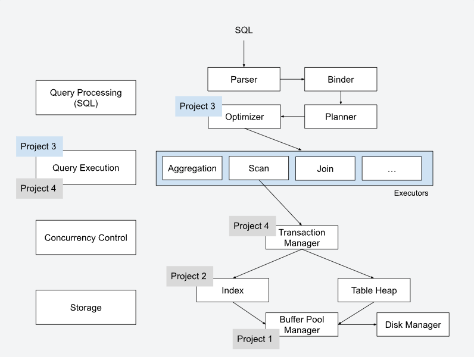
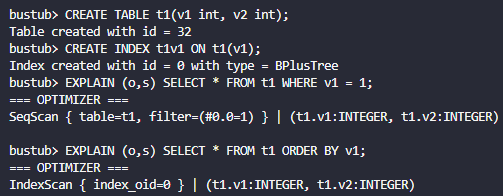
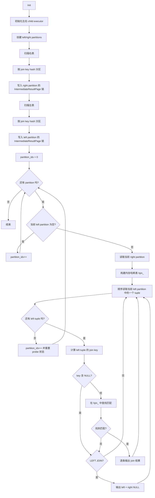

# p3项目记录

P3的源码真是太多了，看的我头晕，理解起来也比较困难，因为我不是科班生，我按照以下两位博主的专栏去整理、学习了一些内容。前两位做的都是2024Fall的project，第三位对p3做了详细的解析，第四位则是p3的开发者。

- https://zhuanlan.zhihu.com/p/690034893
- https://zhuanlan.zhihu.com/p/674080359
- https://zhuanlan.zhihu.com/p/587566135 （p3的解决方案）
- https://zhuanlan.zhihu.com/p/570917775 （在这个项目开始前，推荐阅读p3开发者迟先生的博客）

从project3开始，我们就要逐渐搭建一个数据库的架构了，p1、p2的B+树、缓冲池的内容是数据库的底层内容，而p3要实现的就是SQL查询的算子执行器，以及优化器。

可以参考CMU官网给出的这张流程图：



通过阅读源码 `BusTubInstance::ExecuteSqlTxn` ，可以看到整体的查询逻辑是：

1. Parser采用了 libpg_query 库将 sql 语句 parse 为 AST(语法树)
2. Binder根据AST绑定到数据库实体上，这样的数据结构才能被cpp理解。
3. Planner会生成一个算子树/查询计划，这个算子树的每个节点都是一个AbstractPlanNode对象，每个plannode包含了一个或者多个abstract expression对象。
4. Optimizer根据规则优化查询计划。
5. 最后由executor执行引擎去执行这个算子树。

整个执行过程是`Iterator Model`的（pull-based的火山模型），那么火山模型又是什么？还有其他的执行模型吗(这一问题可以参考第三篇blog，他的Executor篇章介绍了`Materialization Model`与`Vectorization Model`)？

## 火山模型

火山模型（Volcano Model）在软件开发领域**主要指数据库查询执行引擎中的一种经典执行模型**，而非软件开发流程模型。其核心是**通过迭代器接口实现数据的拉取式（Pull-Based）处理**，由上层算子主动向下层算子请求数据，而非下层算子主动推送数据。这一模型由 Goetz Graefe 在 1994 年的论文《Volcano: An Extensible and Parallel Query Evaluation System》中提出，至今仍是 PostgreSQL、MySQL 等主流数据库执行引擎的基础设计范式。

### **1.** 迭代器接口设计

火山模型将每个查询操作（如扫描、过滤、连接）抽象为一个**统一的迭代器（Iterator）**，所有算子必须实现三个标准接口：

- **`init()`**：初始化资源（如打开文件、构建哈希表）。
- **`next()`**：**主动拉取下一条数据**，若无数据则返回空值。
- **`close()`**：释放资源（如关闭扫描器、清空内存）

### **2.** 数据流动方向

- **自底向上拉取数据**：根节点算子（如 `Project`）调用子节点的 `next()` 获取数据，子节点再递归调用其子节点，直到叶子节点（如 `SeqScan`）从存储引擎读取原始数据。
- **控制流与数据流方向相反**：控制流自顶向下（调用 `next()`），数据流自底向上（返回元组）。

## Task #1 - Access Method Executors

需要实现从存储系统中读取和写入表的执行器。

### **Seq Scan (顺序扫描)**:

迭代遍历表，并每次返回一个批次的元组。 *提示*: 使用 `TableIterator` 时，注意前缀递增和后缀递增的区别。不要输出被标记为删除的元组（检查 `TupleMeta` 的 `is_deleted_` 字段）。输出是匹配元组的副本及其原始 RID。

- 可以从**顺序扫描**讲起，整体的逻辑就是：根据 `plan `中的 `table_oid `通过` exec_ctx` 找到目标表，初始化表迭代器，随后在 `Next() `中持续扫描表中` tuple`，跳过已删除记录，并根据下推谓词过滤，把满足条件的 `tuple` 和其` RID `放入输出` batch`，从而完成顺序扫描算子。
- 整体需要获取的资源都可以从`ExectorContext`中找到

### **Insert (插入)**

将元组插入表中并更新任何受影响的索引。它有且只有一个子节点提供值。执行器应当输出一个包含了`std::vector<Value> values`与`schema`的数组，指示插入的行数。

简单描述逻辑就是：

`InsertExecutor`只是一个消费者，他负责调度`insert`这个过程。那么**需要插入的`tuple`数据从哪里来**？数据通过`child_executor`获取，那么只需要校验：`child_executor_->Next`即可。

针对获取的`child_tuples`，我们需要对其都执行一次插入，而真正控制插入的函数是：`InsertTuple`，他会利用我们p1与p2的内容实现插入，且返回一个`optional<RID>`用于后续判断。且由于一张表可能会有多个索引，因此我们需要对每个索引都进行一次更新，最后对每一个索引都执行一次`InsertEntry`即可。

整个插入设计的地方众多，只能按照插入的语义以及对应的内容一步步查找，找到正确的插入函数以及返回格式进行返回。

### **Update (更新)**

修改指定表中现有的元组。输出修改的行数。注意同步更新索引。 

*提示*: 要实现更新，首先删除受影响的元组，然后插入一个新元组。

在`Next`的实现中，通过查询`table_heap`内的接口，我们可以发现，官方建议在`project3`的`update`实现为先删除后插入的过程，因此按照这个流程，先获取旧`tuple`与`rid`，然后从`TableHeap`中标记为删除，同时删除索引，然后通过`update_plan`内的`target_expressions`进行`Evaluate`，获取新的信息，再重新组合成`tuple`，插入到表中，生成新的`rid`，并重新构建索引。

我在写的时候，以为`target_expressions`与在`seq_scan`中遇到的谓词下推相似，是以`tuple`为单位的，但后来才发现在`update_executor.h`中介绍了，是以列为单位的，因此还要从`table_schema`中获取对应列，进行逐列比较。

### **Delete (删除)**

从表中逻辑删除记录。输出删除的行数，并更新索引。

如果完成了`update`，那么`delete`就比较简单了，就是从`update`执行器抄下删除逻辑部分即可。

### **Index Scan (索引扫描) & 优化器规则**

需要实现 `SeqScanAsIndexScan` 优化器规则（谓词下推）。当谓词（Predicate）中包含被索引列的等值测试时，将 `SeqScanPlanNode` 转换为 `IndexScanPlanNode`。需要支持单点查找和同一索引的多个点查找（`OR` 条件）。

- 关于谓词下推的理解：**谓词**‌就是 SQL 里的过滤条件，比如 WHERE 子句、JOIN 的 ON 条件 。**下推**‌就是把这些条件从查询上层"推"到更底层，在数据读取或处理的早期阶段就执行过滤 。简单说就是‌**先过滤再做关联、聚合等操作**‌，让无关数据不参与后续耗时计算 。‌‌‌

1. `IndexScanExecutor` 本身要支持两种执行模式
   - 点查询 Point Lookup
   - 顺序扫描 Ordered Scan
2. Optimizer 要在合适的时候，把原来的计划改写成 `IndexScanPlanNode`
   - `WHERE indexed_col = constant` 这种情况，需要实现 `OptimizeSeqScanAsIndexScan`
   - `ORDER BY indexed_col ASC` 这种情况，项目已经实现了 

通过`EXPLAIN`两种情形可以得到，对点查询进行优化后，计划需要变成：

`IndexScan { index_oid=0, filter=(#0.0=1) }`

而我目前还是`SeqScan`，因此需要完善`Seqscan_as_indexscan.cpp`，来实现优化，具体实现可以参考`order_by_index_scan.cpp`与`aggregation_plan.h`



在实现了plan模式的转变后，针对这个查询语句，其点查询的执行方式是：

1. 从谓词里提取常量 `1`，存储在`pred_keys_`内
2. 构造索引 key
3. 调用 `ScanKey(key, &rids, txn)`
4. 得到对应 RID
5. 回表 `table_heap->GetTuple(rid)`
6. 跳过被删除的 tuple
7. 输出结果

同时可以根据`pred_keys_`的大小，执行两种`IndexScan`，`pred_keys_` 非空时做 `point lookup`，`pred_keys_` 为空时做` ordered scan`。

结合p3的提示，对于该优化器的设计，我是这么写的：

- `OptimizeSeqScanAsIndexScan `只接受：
  - v1 = 1
  - 1 = v1
  - v1 = 1 OR v1 = 4
  - v1 = 1 OR v1 = 1
- 只要出现 AND、不同列、非 =，就直接放弃优化，保留 `SeqScan`

整个Task1写下来，最难的地方就是在optimizer的书写，其他执行器的书写都是在熟悉这个项目，而optimizer是实打实的让你写优化，如何实现作业要求的优化功能，他的列该如何转换，如何去重，如何比较，都需要一个个优化。天天都在报越界...

现在写完了task1，回来看看为什么task1会报错，因为我看到题目让我使用

`tree_ = dynamic_cast<BPlusTreeIndexForTwoIntegerColumn *>(index_info_->index_.get())`

所以我大量使用了`tree_.ScanKey`，但是实际上把他`dynamic_cast `成 `BPlusTreeIndexForTwoIntegerColumn *`，如果碰到`create index t1v1 on t1(v1)`这样的这种单列整型索引时，会被建成 `GenericKey<4>`，而`BPlusTreeIndexForTwoIntegerColumn *`是`BPlusTreeIndex<GenericKey<8>, ...>`的别名，而不是一个模板，因此这时候获取`tree_`会得到`nullptr`，这时候再调用`tree_->ScanKey`当然会越界。这里我用返回来修改了`index_scan_executor`的代码，一种是获取`create index t1v1 on t1(v1)`加上模板函数，构造不同的`tree_`，同时也可以利用`index_info->index_->ScanKey`来实现查询。

## Task #2 - Aggregation & Join Executors

这一节开始，可以主要参考[十一的p3记录](https://zhuanlan.zhihu.com/p/587566135)，他详细介绍了每一种情况书写起来会碰到的问题。

### **Aggregation (聚合)**

为每一组输入计算聚合函数。输出 Schema 为 Group-by 列 + 聚合列。 在本项目中，你可以假设聚合哈希表**完全可以装入内存**。我们提供了一个 `SimpleAggregationHashTable` 数据结构，你需要完成其 `CombineAggregateValues` 函数。 *提示*: 聚合是一个 Pipeline Breaker（管道断路器）。需要仔细权衡是在 `Init()` 还是 `Next()` 中执行聚合的 Build（构建）阶段。必须处理聚合输入中的 NULL 值。

**什么是pipeline breaker？**

在数据库执行查询时，最理想的模式是**流式处理（Pipelining）。例如**它们拿到一条数据，立刻处理后传给下一个节点，**不需要把数据存起来**。这种操作可以无缝衔接，内存占用极小。

而对于`pipeline breaker`，课件是这么描述的：**A pipeline breaker is an operator that cannot finish until all its children emit all their tuples.**

因此在`Aggregation`这个算子的`Init()`函数，就要把所有的结果计算出来。而聚合得到的结果暂存在`SimpleAggregationHashTable`内，且项目假设该数据结构内存足够，不需要再实现内存池/分区的操作。

同时要注意的是，如果整个`Aggregation`的结果是一个空表，那么他也是需要返回值的，具体可以在运行如下测试时可以了解到。这时就需要考虑到官方的`InsertCombine`函数可能会造成COUNT(*)的统计错误。

```shell
./bin/bustub-sqllogictest ../test/sql/p3.07-simple-agg.slt --verbose
```

针对插入时的NULL值，需要修改`AggregateKey`的比较。

### 连接执行器 (Join)

关于连接的含义，以及逻辑可以查阅[**数据库连接**wiki](https://zh.wikipedia.org/wiki/%E8%BF%9E%E6%8E%A5)

#### **Nested Loop Join (嵌套循环连接)**

针对没有索引的表进行连接，实现内连接或左外连接。

针对这个执行器，需要注意的是Next()是一个batch 接口，他不需要一次就完成所有的计算，因此需要记录上下文，保留左表信息、右表信息、当前left_tuple是否完成匹配。

整体的`Next()`逻辑就是：

```c++
 while output size < batch_size:
        if left tuple not ready:
            fetch next left tuple
            if no more left tuples:
                return false
            matched = false
            right_offset = 0

        while right_offset < right_cache.size and output size < batch_size:
            if predicate(left, right_cache[right_offset]) is true:
                emit joined tuple
                matched = true
            right_offset++

        if right_offset == right_cache.size:
            if join type is LEFT and matched == false:
                emit (left tuple + right-side NULLs)
            move to next left tuple
            matched = false
            right_offset = 0

    return output is not empty
```

同时要注意，在每次`emit`时，都需要检查容器长度，在写这一部分时，如果是`left join`，右表无匹配，此时需要返回一个`(left_tuple, null_tuple)`，如果不检查大小就会造成越界。

#### **Nested Index Join (嵌套索引连接)**

当连接条件的右侧有索引时，通过探测索引进行高效连接。

这里不再查询整个右表，而是利用索引快速查询。

```c++
for each outer tuple from child executor:
    key = evaluate key_predicate on outer tuple
    rids = index.ScanKey(key)
    for each rid:
        inner_tuple = inner_table.GetTuple(rid)
        output outer_tuple + inner_tuple

    if LEFT JOIN and no inner tuple found:
        output outer_tuple + right-side NULLs
```

在跑`Extra checks: ["ensure:nlj_init_check"]`这个check时，会出现报错，报错提示我：

nlj check failed, are you initializing the right executor every time when there is a left tuple?

这说明在做**Nested Loop Join**时我的断言出错了，我遵照了缓存的写法，但是这里官方检查的是标准 NLJ，即对每一个左表的tuple，都要对右表进行一次`init()`。

所以逻辑就会变成：

```c++
 while output size < batch_size:
        if left tuple not ready:
            fetch next left tuple
            if no more left tuples:
                return false
            matched = false
            right_offset = 0
		if left is new:
			right_executor init
        while right_offset < right_cache.size and output size < batch_size:
            if predicate(left, right_cache[right_offset]) is true:
                emit joined tuple
                matched = true
            right_offset++

        if right_offset == right_cache.size:
            if join type is LEFT and matched == false:
                emit (left tuple + right-side NULLs)
            move to next left tuple
            matched = false
            right_offset = 0

    return output is not empty
```


## Task #3 - Hash Join Executor and Optimization

如果等值连接条件没有索引，Nested Loop Join 的性能会极差。你需要实现：

1. **Hash Join (哈希连接)**: 在内存中构建哈希表以执行等值连接。Build 阶段读取右侧子节点的所有元组构建哈希表，Probe 阶段读取左侧元组进行探测。
2. **Hash Join Optimization (优化器规则)**: 实现规则将 `NestedLoopJoin` 转换为 `HashJoin`（当检测到等值条件 `=` 时）。

根据我阅读几位大佬的文章，以前应该是没有这个内容的，原先是作为leaderboard的优化去写的，这个内容作为task也说明了他是数据库比较重要的性能优化的一环。同时官方希望在面对大表时采用Grace Hash Table来解决容量问题，这个之后再去优化了。

具体的哈希表设计，我直接按照`SimpleAggregationHashTable`内的设计去修改的，同样的，Task3是对Task2的优化，所以他也是一个pipeline breaker，这里我在Init时就对右表做好hash缓存，之后每一次Next都要做索引记录。

在写完哈希表逻辑之后，最好根据作业描述，修改成Grace Hash Table，具体可以看一下[这一篇博客](https://aaaaaaron.github.io/2022/10/31/grace-hash-join/)，他也做了一些拓展。

同样的，在这里利用Grace Hash Table唯一的区别就是：当$tuple batch size >= batch size$中  断时，需要考虑的事情增加了：

- 分区是否执行完，是否需要加载新的分区
- 当前分区右表位置
- 一个`key`对应了右表多个`tuple`，当前`tuples`内的位置也需要保存
- 当前分区左表位置
- 何时需要切换分区，左右表分区的对应关系是什么

当然如果利用`Grace Hash Table`算法也放不下时，就需要利用到`IntermediateResultPage`，将`hash`表暂存入页中进行替换。

对于$NLJ->HashJoin$的优化器，基本就是参照$NLJ->IndexJoin$去写就行，只需要注意需要递归所有子树，同时对返回的`key`需要支持如下类型，因此需要针对所有节点类型都做判断：

```sql
<column expr> = <column expr> AND <column expr> = <column expr> AND ...
```

加入了intermediate_result_page后的流程图。




## Task #4 - External Merge Sort + Limit Executors + Window Functions

Task4实现三个算子，外部归并排序、Limit、窗口函数。

### 外部归并排序

对于排序，最难做的就是读源码，理解每个文件需要实现的内容是什么。

对于排序规则，需要在`execution_common`内实现。

- 行的比较：每个Key都去比较 Key是NULL的情况
- ASC、DECS的设置
- NULLS FIRST/LAST
- DEFAULT : ASC

`external_merge_sort_executor`内主要利用`intermediate_result_page`去把 `tuple `存到磁盘页，最后利用`run `和 `run iterator`两两比较，得到最后的结果。

我是在这里实现`intermediate_result_page`，然后回去把`Task3`的 `grace hash join`完善的，直到做到`Task4`我才想好`intermediate_result_page`内真正需要的是什么，他只需要将`tuple`存到页就行，只是一个工具类罢了。

我的`intermediate_result_page`只做了最基础的功能，基本是按照`table_page`去写的，把`table_page`根据`RID`读取的形式改成了顺序插入按槽读取，写的自己方便就行:

1. 支持顺序追加 `Tuple`
2. 支持按槽位读取第 `i` 个 `Tuple`
3. 支持查询当前页 tuple 数、剩余空间、是否满
4. 有 `next_page_id_` 便于切换

说来惭愧...我是第一次见到`table_page`这种写法，利用页内存管理数据，因此要考虑增长问题，每组`tuple`的`offset`和`size`在`slot array`内从前向后增长，而`tuple`则从后向前写入，根据如下的分配，就需要考虑`tuple`在写入时是否会覆盖到`slot array`的内存了。

```
---------------------------------------------------------
| HEADER | slot array ... | free space | tuples |
---------------------------------------------------------
                            ^            ^
                       slot_end      free_space_pointer
```

最后就是结合之前所有内容，实现归并排序。这个归并排序也可以优化，先计算好所有的`key`再进行排序。整体而言就和`leetcode`里的有序链表合并一样做就行。当然也可以进一步优化，每一次在保存到`intermediate_result_page`内时，保留`SortKey`，这样在归并时避免重复计算。

同时这里讲的是外部归并排序，所以在排序时我是边比较边写入新的`run`。

整体写下来就和leetcode内的[合并两个有序链表](https://leetcode.cn/problems/merge-two-sorted-lists/description/)一样。

### Limit算子

比较简单，直接比大小，如果$limit > batchSize$大时需要保留剩余元组数。

### Window Function

`WindowFunctionExecutor` 要做的是“对每一行都输出一个结果”，但这个结果不是只看当前行，而是看“当前行所在的一组行（partition）”，以及“这组里排在当前行之前/到当前行为止的那些行（order by）”。

目前Window Function只需要两种语义：

- 没有 `ORDER BY`：
  这行的窗口值 = 它所在 partition 的“整组聚合结果”。
  对每个 partition 跑一次整组聚合，然后把结果复制给该 partition 的每一行。

- 有 `ORDER BY`：
  这行的窗口值 = 它所在 partition 中，按 `ORDER BY` 排序后，从开头到当前行为止的“前缀聚合结果”。
  对每个 partition 按当前顺序从前往后扫，维护一个“运行中的 aggregate state”。每读到一行就 `Combine` 一次，并把当前 state 记到这一行。

在这里由于要排序我就简单做了，在Init()时就把所有 tuple 全读出来，判断是否有`ORDER BY` ， 对每个 window 列单独计算一列结果并拼出输出。

## Leaderboard

Leaderboard Task 包含三条极其诡异的 `sql`，要做的就是增加新的优化规则，让这三条 `sql `执行地越快越好，避免段错误/超时。分三个部分：

- Query 1: **Too Many Joins!**
- Query 2: **The Mad Data Scientist**
- Query 3: **All that work, for a little thing?**

### Query 1: Too Many Joins!

SQL:

```sql
SELECT * FROM t4, t5, t6
  WHERE (t4.x = t5.x) AND (t5.y = t6.y) AND (t4.y >= 1000000)
    AND (t4.y < 1500000) AND (t6.x >= 100000) AND (t6.x < 150000);
```

简单来说就是`join `条件和普通过滤条件混在一起，无法直接转成 `HashJoin` ，单表过滤条件没有尽早下推到 `SeqScan`，扫描和 join 的数据量都太大。

理解这个题目真心有点累，看着简单但是需要自己在`OptimizeCustom`内实现一个新的优化方案。

从题目可以看到我们需要修改`NLJ`与`hash_join`的优化器，我的想法是拆分`OptimizeMergeFilterNLJ`的职责：

1. 把 `WHERE` 里的大条件按 `AND` 拆开
2. 判断每个子谓词属于左子树、右子树，还是跨左右两边
3. 左右单边谓词继续往下推
4. 跨左右两边的等值谓词保留在当前 `join `上
5. 递归重复这个过程，直到推到最底层
6. 最后把只剩 join key 的 `NLJ`转换成 `HashJoin`

一开始我就是拆分了谓词，但是没有继续下推，没有到最下层，查了很久bug。

到最后我就写了这一个query，之后有时间再写吧...写起来太麻烦了，但是在不断的修缮中可以学到很多。
