# **Project #4 - Concurrency Control (项目 #4 - 并发控制)**

**Last Updated: Dec 07, 2025**

> 记得从 bustub 仓库拉取最新代码。**不要**将你的代码发布到公开的 GitHub 仓库上。

## **Overview (概述)**

在本项目中，你将通过实现乐观多版本并发控制（MVOCC）来为 BusTub 添加事务支持。该项目包含四个必做任务和两个排行榜基准测试（Leaderboard benchmarks）。

- [Task #1 - Timestamps (时间戳)](https://www.qianwen.com/chat/28b9e3afd7774017898851a1ebc89334#task-1---timestamps)
- [Task #2.1 - Storage Format (存储格式)](https://www.qianwen.com/chat/28b9e3afd7774017898851a1ebc89334#task-2---storage-format-and-sequential-scan)
- [Task #2.2 - Sequential Scan / Tuple Retrieval (顺序扫描 / 元组检索)](https://www.qianwen.com/chat/28b9e3afd7774017898851a1ebc89334#22-sequential-scan-tuple-retrieval)
- [Task #3 - MVCC Executors (MVCC 执行器)](https://www.qianwen.com/chat/28b9e3afd7774017898851a1ebc89334#task-3---mvcc-executors)
- [Task #4 - Primary Key Index (主键索引)](https://www.qianwen.com/chat/28b9e3afd7774017898851a1ebc89334#task-4---primary-key-index)

本项目必须**独立完成**（即不允许组队）。在开始之前，请运行 `git pull public master` 从公共 [BusTub 仓库](https://github.com/cmu-db/bustub) 拉取最新代码，然后重新运行 `cmake` 以重新配置 Makefile。

我们建议在开始编写代码前先将整篇文档通读一遍。如果你没有时间（因为这篇文档相当长），你可以重点阅读 Task 1 和 Task 2 的部分，因为它们包含了关于实现的具体指导。这比你漏掉某些信息、错误实现然后不得不重头再来要快得多。

- **Release Date (发布日期):** Nov 10, 2025
- **Due Date (截止日期):** Dec 07, 2025 @ 11:59pm

## **Background (背景)**

在之前的项目中，BusTub 作为一个单版本 DBMS 运行。现在你将添加对 MVCC 的支持，而无需修改其核心表存储架构（即 table heaps）。这种 MVCC 协议的高阶版本已被应用于 [HyPer](https://hyper-db.de/) 和 [DuckDB](https://duckdb.org/) 等 DBMS 中。

该协议中的存储模型类似于课堂上讨论的 delta table（增量表）架构。对于存储的每一个元组（tuple），DBMS 还会在 undo logs（撤销日志）中额外存储 tuple deltas（元组增量）。table heap 中的元组及其对应的 undo logs / deltas 形成了一个单向链表，称为 **version chain（版本链）**。借助这条版本链，DBMS 在逻辑上“存储”了元组的每一个历史版本。也就是说，DBMS 仅存储每个版本之间的 deltas，而不是元组的完整版本。

DBMS 将 undo logs 存储在事务的内存工作区（in-memory workspace）中，而事务本身则存储在事务管理器的内存数据结构中。在生产系统中，这些日志会被持久化到磁盘，但本项目不要求 BusTub 这样做。

你首先需要为所有事务实现 `SNAPSHOT ISOLATION`（快照隔离）级别。随后，你将在 [Task #4.4](https://www.qianwen.com/chat/28b9e3afd7774017898851a1ebc89334#44-serializable-verification) 中扩展你的并发控制协议，以支持 `SERIALIZABLE`（可串行化）隔离级别。

在每个测试用例中，测试用例内的所有事务都在相同的隔离级别下运行。所有并发测试用例都是公开的，所有隐藏的测试用例都是单线程的。在 Gradescope 上，你会找到每个测试用例具体在做什么的描述。

## **Project Specification (项目规范)**

与之前的项目一样，我们提供了定义你必须实现的 API 的类。除非另有说明，**不要**修改这些类中预定义函数的签名或移除预定义的成员变量。如果你这样做了，我们的测试代码将无法运行，你将无法获得本项目的学分。你可以根据需要向这些类中添加私有辅助函数和成员变量。

以下是你在本项目中可能需要修改的文件列表：

- `src/include/concurrency/transaction_manager.h`
- `src/concurrency/transaction_manager.cpp`
- `src/include/execution/execution_common.h`
- `src/execution/execution_common.cpp`
- `src/include/execution/executors/seq_scan_executor.h`
- `src/execution/seq_scan_executor.cpp`
- `src/include/execution/executors/index_scan_executor.h`
- `src/execution/index_scan_executor.cpp`
- `src/include/execution/executors/insert_executor.h`
- `src/execution/insert_executor.cpp`
- `src/include/execution/executors/update_executor.h`
- `src/execution/update_executor.cpp`
- `src/include/execution/executors/delete_executor.h`
- `src/execution/delete_executor.cpp`
- `src/include/concurrency/watermark.h`
- `src/concurrency/watermark.cpp`

以下是在本项目中可能会有所帮助的函数/类列表：

- `TableHeap`: `MakeIterator`, `GetTuple`, `GetTupleMeta`, `UpdateTupleMeta`, `UpdateTupleInPlace`, `MakeIterator`, `MakeEagerIterator`（对于 Task #3.6 及之后的任务，包括所有带 `Lock` 的函数）。
- `Tuple`: `SetRid`, `GetRid`, 额外的 `Tuple` 构造函数, `Empty`, `IsTupleContentEqual`, `GetValue`。
- `Value`: `ValueFactory::Get____`, `ValueFactory::GetNullValueByType`, `CompareExactlyEquals`。
- `Schema`: `GetColumn`, `GetColumnCount`。
- `TransactionManager`: `UpdateUndoLink`, `GetUndoLink`, `GetUndoLog`, `GetUndoLogOptional`, `UpdateTupleAndUndoLink`, `GetTupleAndUndoLink`
- `Transaction`: 所有成员函数都很重要，以及 `UndoLink` 和 `UndoLog` 结构体。

你可能需要频繁地将一个 optional value 映射到其他内容。你可以使用以下语法编写更简洁的代码（monadic operations）：`auto x = opt.has_value() ? operation(*opt) : std::nullopt;`。
你也可以使用 C++14 的元组解包语法：`auto [meta, tuple] = iter->GetTuple();`。

本项目的正确性依赖于你对 [Project #1](https://www.qianwen.com/project1) 和 [Project #2](https://www.qianwen.com/project2) 实现的正确性。即使没有完整实现 [Project #3](https://www.qianwen.com/project3)，你也可以在本项目中获得满分，但这是因为你需要基于 MVCC 存储重写你已经实现的大部分访问方法执行器（access method executors）。此外，[Task 4.2](https://www.qianwen.com/chat/28b9e3afd7774017898851a1ebc89334#42-index-scan-delete--update) 需要一个能将顺序扫描转换为索引扫描的优化器规则的有效实现。最后，完成本项目的排行榜测试需要 [Project #3](https://www.qianwen.com/project3) 中一个可运行的聚合执行器（aggregation executor）。

**我们不为之前的项目提供标准答案（solutions）。**

------

## **Task #1 - Timestamps (时间戳)**

在 BusTub 中，每个事务被分配两个时间戳：**read timestamp（读时间戳）**和 **commit timestamp（提交时间戳）**。我们将详细介绍这些时间戳是如何分配的。在本任务中，你需要在事务管理器上实现此功能，以便它能正确地为事务分配时间戳。

### **1.1 Timestamp Allocation (时间戳分配)**

当事务开始时，它会被分配一个 read timestamp，该时间戳等于**最近提交事务的 commit timestamp**。从宏观上看，你可以将其理解为记录数据库最新一次原子写入的时间戳。read timestamp 决定了事务可以安全、正确地读取哪些数据。也就是说，read timestamp 决定了当前事务能看到的元组的最新版本。

当事务提交时，它会被分配一个单调递增的 commit timestamp。commit timestamp 决定了事务的序列化顺序（serialization order）。由于这些 commit timestamp 是唯一的，我们也可以通过 commit timestamp 来唯一标识已提交的事务。

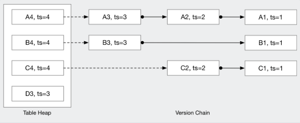

在上图中，A1 指的是元组 A 的第一个版本，A3 指的是元组 A 的第三个版本。A4 指的是元组 A 的第四个版本，也是元组 A 最新或“真实”的版本。B4 和 C4 实际上分别是元组 B 和 C 的第三个版本，我们这样标记只是为了方便下文解释。

时间戳（`ts=#`）指的是元组所属事务的 commit timestamp。因此 [A1, B1, C1] 属于 commit timestamp = 1 的事务（我们可以简称为事务 1），而 [A3, B3, D3] 属于 commit timestamp = 3 的事务（事务 3）。图中最近提交的事务是 commit timestamp = 4 的事务，包含 [A4, B4, C4]。

假设我们有一个事务，其分配的 read timestamp 为 3。这意味着我们的事务在事务 3 提交之后、事务 4 提交之前开始。因此，我们的事务只能观察到 [A3, B3, C2, D3]。

对于 [A, B, C]，我们的事务无法观察到 [A4, B4, C4]，因为这些元组版本的时间戳都是 4（相对于我们 read timestamp 3 来说是在“未来”）。我们的事务需要遍历每个元组的 undo logs，并读取它遇到的第一个版本号小于或等于 3 的版本。对于 A 和 B，它遇到的第一个版本是 A3 和 B3。对于 C，遇到的第一个版本是 C2。对于 D，由于元组的当前版本时间戳已经是 3，因此直接读取是安全的。

另一个例子是，如果我们的 read timestamp 是 2，那么我们的事务将只能看到 [A2, B1, C2]，因为 D 是在时间戳 3 时才创建的（相对于 read timestamp 2 是在未来）。

在本任务中，你需要为事务分配正确的 read timestamp 和 commit timestamp。更多信息请参阅 `src/include/concurrency/transaction_manager.h` 中的 `TransactionManager::Begin` 和 `TransactionManager::Commit`。我们已经提供了 `TransactionManager::Abort` 的初始代码，为了在 Task #1 中获得满分，你不需要在 `Abort` 中做任何修改。

### **1.2 Watermark (水位线)**

watermark 是所有**尚未提交或中止**的事务中最低的 read timestamp。如果没有这样的事务，watermark 就是最新的 commit timestamp。计算 watermark 最简单的方法是遍历事务管理器 map 中的所有事务，并找到所有进行中（in-progress）事务的最小 `read_ts`。

然而，这种简单的策略效率低下。在本任务中，你需要实现一个时间复杂度为 `O(log N)` 的算法来计算 watermark。更多信息请参阅 `watermark.h` 和 `watermark.cpp`。你还需要在事务开始/提交/中止时调用 `Watermark::AddTxn` 和 `Watermark::RemoveTxn`。

实现方法有很多种。参考解决方案使用 hash map 实现了一个均摊 `O(1)` 的算法，此外 C++ 标准库中还有一个有用的 [container](https://en.cppreference.com/w/cpp/container) 可能会让 `O(log N)` 的实现变得简单。

完成此部分后，你应该能通过 `TxnTimestampTest` 测试套件中的所有测试用例。

------

## **Task #2 - Storage Format and Sequential Scan (存储格式与顺序扫描)**

BusTub 将事务数据存储在三个地方：table heap、事务管理器以及每个事务的 workspace 内部。table heap 始终包含最新的元组数据。事务管理器为每个元组存储一个指向最新 undo log 的指针（`PageVersionInfo`）。事务存储它们创建的 undo logs，这些日志记录了事务是如何修改元组的。

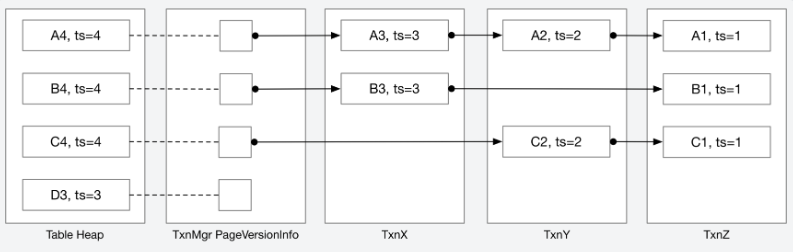

要在给定的 read timestamp 检索元组，你需要：(1) 获取在给定时间戳之后发生的所有修改（即 undo logs），(2) 从元组的最新版本回滚这些修改（“撤销” undo logs），以恢复该元组的历史版本。

这类似于我们在课堂上讲的 delta table 存储模型，只是这里没有物理上的“delta table”来存储 delta 记录。相反，这些记录存储在每个事务的 workspace 中（不持久化到磁盘），以简化实现。

### **Data Structures & Helper Functions (数据结构与辅助函数)**

本节将引导你了解元组重构和后续操作所需的数据结构。我们建议将此介绍与初始代码（starter code）结合阅读。如果在其他任务中遇到任何问题或困惑，可以回到本节。

DBMS 将 `Tuple` 和 `TupleMeta` 数据存储在 `TableHeap` (`src/include/storage/table_heap.h`) 中。你可以调用 `GetTuple` 或 `GetTupleMeta` 等辅助函数来获取数据，使用 `UpdateTupleInPlace` 为单线程测试用例更新元组，并使用 `InsertTuple` 将元组插入 table heap（这些函数定义在 `table_heap.h` 中）。你可能会注意到还有 `UpdateTupleInPlaceWithLockAcquired` 等函数，这些是你在并发任务中使用的。

事务头文件 (`src/include/concurrency/transaction.h`) 包含了用于跟踪事务运行时行为和状态的类和对象。

`UndoLog` 结构体存储了事务对元组的修改/删除信息。[Task 2.1](https://www.qianwen.com/chat/28b9e3afd7774017898851a1ebc89334#21-tuple-reconstruction) 详细介绍了 `UndoLog` 的格式。DBMS 可以基于这些 `UndoLog` 重构元组。每个事务存储一个 `UndoLog` 向量，包含该事务修改过的每个元组的 deltas。例如，如果 txn1 更新了元组 1 和元组 2，txn1 将为元组 1 和元组 2 各存储一个 UndoLog。事务将记录元组 1 和元组 2 先前版本之间的 delta 以及 txn1 自己的版本。你的实现应调用 `ModifyUndoLog` 来修改现有的 `UndoLog`，并调用 `AppendUndoLog` 来追加新的 `UndoLog` (`src/include/concurrency/transaction.h`)。通过将单个事务的所有 `UndoLog` 存储在一起，我们可以在事务提交或中止时轻松更新这些修改过的元组及其版本信息。

`UndoLink` 结构体是指向 `UndoLog` 的指针。我们使用 `UndoLink` 将每个元组的所有 `UndoLog` 链接在一起。它们定义如下：

```c++
/** Represents a link to a previous version of this tuple */
struct UndoLink {
  /* Previous version can be found in which txn */
  txn_id_t prev_txn_{INVALID_TXN_ID};
  /* The log index of the previous version in `prev_txn_` */
  int prev_log_idx_{0};
};
```

一个 `UndoLink { prev_txn_: txn5, prev_log_idx_: i }` 指向 txn5 的 `undo_logs_` 缓冲区中的第 `i` 个 `UndoLog`。你可以通过调用 `GetUndoLog` 和 `GetUndoLogOptional` (`src/concurrency/transaction_manager_impl.cpp`) 从给定的 `UndoLink` 获取目标 `UndoLog`。如果 `UndoLink` 中的 `prev_txn_` 具有无效的事务 ID，则意味着该 `UndoLink` 无效且不指向任何有效的 `UndoLog`，因此你只应在确定 `UndoLink` 有效时使用 `GetUndoLog`，否则请使用 `GetUndoLogOptional`。

### **2.1 Tuple Reconstruction (元组重构)**

在本任务中，你将通过 `execution_common.cpp` 中定义的 `ReconstructTuple` 函数实现元组重构算法。在本项目中，你可能会发现许多功能可以被系统中的不同组件共享。你可以在 `execution_common.cpp` 中定义辅助函数。

`ReconstructTuple` 接收四个输入：

1. 元组 schema。
2. base tuple（基础元组）。
3. Metadata（元数据，两者都存储在 table heap 中）。
4. 按从最近修改到最旧修改顺序排列的 undo logs 列表。

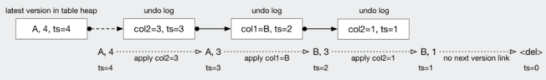

Base tuples（位于“table heap 中的最新版本”下方）始终为其 schema 中的每一列存储一个值（换句话说，它们是完整且有效的元组）。然而，undo logs 仅包含被操作更改过的列。Undo logs 还有一个 `is_delete` 标志，表示整个元组被删除。

base tuple metadata 和 undo logs 都会有 `is_delete` 标志，且它们并不总是相等的。在 task 4.2 中，你将不得不将一个元组“插入”到现有的 RID 中，因此你需要在 `UndoLog` 中使用这个 `is_delete` 标志来执行此类操作（想象在一个循环中插入并删除完全相同的元组）。`is_delete` 标志的工作示例如下所示。请确保你理解这些 undo logs 是在**时间上倒退**的。作为一个练习，试着推断出可能导致这个特定版本链的操作序列：

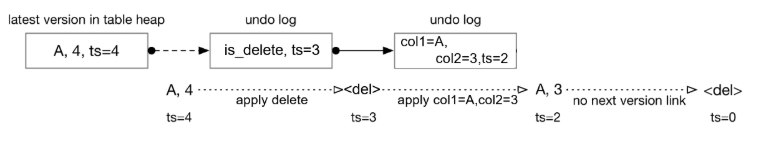

`ReconstructTuple` 应该应用提供给该函数的所有修改，而**不需要**查看 metadata 或 undo logs 中的时间戳。它不需要访问函数参数列表中提供的数据以外的数据。换句话说，确保你不要向 `ReconstructTuple` 传递过多的 undo logs。

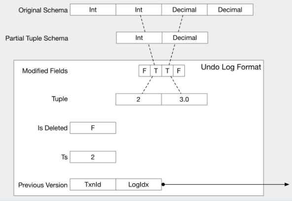

`UndoLog` 表示对某个元组的部分修改（在由 `ts_` 字段确定的某个时间点）。`UndoLog` 中的 `modified_fields_` 成员是一个 `bool` 向量，其长度与表 schema 中的列数相同。如果其中一个布尔值设置为 `true`，则表示元组中相应的字段已被该 `UndoLog` 更新。例如，如果 `modified_fields_` 向量的第 3 个元素（索引 2）设置为 `true`，则意味着元组的第三列被更新了。

`tuple_` 字段包含部分的 `Tuple`，它的 values/columns 数量应与 `modified_fields_` 向量中 `true` 的数量相同。要从部分元组中检索值，你需要基于表 schema 和修改过的字段构建一个部分的 `Schema`。然后你可以使用该部分 `Schema` 从部分 `Tuple` 中提取值。

时间戳（`ts_`）是此 `UndoLog` 对应的 **commit** timestamp。我们还存储了一个指向下一个 `UndoLog` 的链接（`prev_version_` 通过 `UndoLink` 存储）。如果一个 `UndoLog` 是版本链中的最后一个，TxnId（对应于代码中 `UndoLink` 内部的 `prev_txn_`）将被设置为 `INVALID_TXN`。你可以使用 `prev_version_.IsValid()` 辅助函数快速检查这一点。提醒一下，你**不需要**在 `ReconstructTuple` 中使用或甚至检查时间戳（`ts_`）字段和前一个版本（`prev_version_`）字段，因为 `prev_version_` 只能由 `ReconstructTuple` 的调用者使用，以找出输入向量中应放置哪些 `UndoLog`。

在上面的例子中，我们存储具有四列的元组。这个特定的 `UndoLog` 表示对字段 2 和 3 的修改。试着（在纸上）写出伪代码，说明如何用这 2 个特定字段的更改来重构过去的元组。然后，尝试将该算法泛化，适用于任何类型的输入元组、任意数量的修改字段以及任意数量的 undo logs。完成这些后，你就可以编写 `ReconstructTuple` 了！

### **2.2 Sequential Scan (Tuple Retrieval) (顺序扫描 / 元组检索)**

在本任务中，你需要重写 [Project #3](https://www.qianwen.com/project3) 中的顺序扫描执行器（sequential scan executor），以支持从过去检索数据（基于事务的 read timestamp）。

对于你的新顺序扫描执行器从 table heap 扫描到的每个元组，它应该检索该元组直到事务 read timestamp 的所有 undo logs，重构过去的元组版本，然后输出该过去的元组。你需要在 `execution_common.cpp` 中实现 `CollectUndoLogs` 辅助函数。此函数返回重构元组所需的所有 undo logs（相对于给定事务的 read timestamp）。

给定当前事务的 read timestamp，你需要处理三种情况：

1. table heap 中的元组是相对于 read timestamp 的最新数据。你可以通过检查元组 metadata 中的时间戳来确认。在这种情况下，无需执行 undo，`CollectUndoLogs` 应返回一个空向量。
2. table heap 中的元组要么被另一个未提交的事务修改过，要么它比事务的 read timestamp 更新。在这种情况下，你需要遍历版本链以收集 read timestamp 之后的所有 undo logs。
3. table heap 中的元组包含**当前事务**的修改。换句话说，我们正在读取一个我们自己修改过的元组。此情况的解释如下。

为了支持情况 3 且不改变我们时间戳的结构（它们只是 `int64_t`），我们将使用时间戳的高位作为标签来表示“临时（temporary）”时间戳。在 BusTub 中，commit timestamp 在 0 到 `TXN_START_ID - 1` 之间是有效的。`TXN_START_ID` 被定义为 64 位整数的第二高位（`1 << 62`）。

如果时间戳的第二高位被设置为 1（`& 1 << 62`），这意味着该元组已被一个事务修改，且该事务**尚未提交**。我们称这个时间戳为“临时事务时间戳（temporary transaction timestamp）”，通过 `TXN_START_ID + txn_human_readable_id = temp_txn_id` 计算得出。我们采用这种方法来区分具有 commit timestamp 的已提交元组和处于特定事务 ID 下的未提交元组。`UndoLog` 中**永远不应**包含临时事务时间戳（我们将在后续部分解释）。

我们不使用实际的最高位（`1 << 63`）的原因是，这样我们可以继续使用 `<` 和 `>` 以直接的方式比较临时时间戳。设置最高位会导致时间戳变成负数。

BusTub 中的第一个事务 ID 是 `TXN_START_ID`，并且 ID 是单调递增的。请确保你理解**事务 ID 与 commit timestamp 不同**，尽管两者都是单调递增的。由于 `TXN_START_ID` 是一个难以解释的大数字，我们将在日志记录和调试时通过剥离最高位来生成一个人类可读的 id。你不需要手动计算未提交事务的临时时间戳，你可以使用现有的辅助函数 `GetTransactionTempTs` 来返回该事务的临时时间戳 (`src/include/concurrency/transaction.h`)。

我们将使用 `txn***` 的表示法，其中 `***` 是人类可读的 ID，来表示事务 ID。例如，`txn42` 表示 ID 为 `TXN_START_ID + 42` 的事务，即人类可读 ID 为 42 的事务。假设当前事务的人类可读 ID 为 3，它扫描到一个时间戳为 `TXN_START_ID + 3` 的 base tuple。那么该事务就知道它自己是该元组最近的修改者。处理情况 3 的这种子情况等同于处理情况 1。思考一下，如果它看到的是另一个未提交事务的临时事务时间戳，应该发生什么。

**Examples (示例)**
假设 `txn9` 更新了元组 A，这意味着元组 A 的时间戳将被设置为 `TXN_START_ID + 9`。当 `txn9` 最终提交时，元组 A 的时间戳将被替换为 `txn9` 的 commit timestamp。在代码中，这看起来如下：

1. `txn9` 修改元组 A。
2. `txn9` 使用 `GetTransactionTempTs` 将元组 A 的时间戳设置为 `TXN_START_ID + 9`。
3. 当 `txn9` 提交时，它通过 `GetCommitTs` 将元组 A 的时间戳替换为其新的 commit timestamp。
4. 其他事务可以使用元组 A 的时间戳来区分它是被已提交还是未提交的事务修改过的。（你可以通过简单地将时间戳与 `TXN_START_ID` 进行比较来实现）。

这是 `SeqScanExecutor` 的最后一个例子。为了让我们的插图更容易理解，下面例子中的 `TXN_START_ID` 将是 `1000` 而不是 (`1 << 62`)。因此，`1009` 表示事务 ID 为 9 的临时事务时间戳（在这个例子中 `TXN_START_ID + 9 = 1009`）。

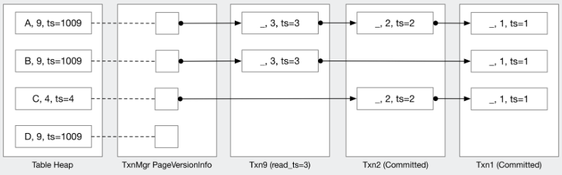

让我们看看下面的例子，我们遍历版本链来收集 undo logs 以构建用户请求的元组：
假设我们有一个 ID 为 9、read timestamp 为 3 的事务。`txn9` 尚未提交（因为存在临时事务时间戳 `1009`）。`txn9` 对表进行顺序扫描的结果应该是：`[(A, 9), (B, 9), (C, 2), (D, 9)]`。对于除 (C, 2) 之外的所有元组，事务 9 已经是修改它们的事务，因此它不需要遍历 undo logs。然而，(C, 2) 的 commit timestamp 为 4，大于我们的 read timestamp 3。因此事务 9 知道要遍历 undo logs 以找到该元组 commit timestamp 小于或等于 3 的第一个版本。

考虑另一个 read timestamp 为 4 的事务。该事务顺序扫描的结果将是：`[(A, 3), (B, 3), (C, 4)]`。对于 (A, 3) 和 (B, 3)，table heap 包含来自 `txn9` 的 pending update（待定更新），因此该事务需要遍历版本链以获取时间戳 4 之前/时的最后一次更新。(C, 4) 是 read timestamp 4 时的最新更新。(D, 9) 是事务 9 的 pending update，由于它没有版本链，我们不需要返回它。通常，如果在给定的 read timestamp 下元组没有以前的版本，那么事务应将其视为**元组不存在**。

与测试用例相比，这些例子被过度简化了。在实现 `SeqScanExecutor` 时，你还需要考虑 `NULL` 数据和整数以外的数据类型。

一旦你完成了 `CollectUndoLogs` 和 `ReconstructTuple` 的实现，如何使用这两个函数完成 MVCC 版本的 `SeqScanExecutor` 就应该很清楚了。base tuple、tuple metadata 以及属于该元组的第一个 undo link 可以通过 `GetTupleAndUndoLink` 获得。

我们的测试用例将手动设置一些事务和 table heap 内容。你**不需要**实现 insert executor 来测试你的顺序扫描实现。此时，你应该能通过 `TxnScanTest` 中的所有测试用例。

------

## **Task #3 - MVCC Executors (MVCC 执行器)**

在本节中，你需要实现数据修改执行器。这包括 insert executor、delete executor 和 update executor。从本任务开始，你的实现将与 Project #3 **不兼容**，因为我们仅支持固定大小数据类型的 schemas。

### **3.1 Insert Executor (插入执行器)**

你的 insert executor 实现应该与 [Project #3](https://www.qianwen.com/project3) 中的类似。你可以在 table heap 中创建一个新元组，并且你需要正确构建元组的 metadata。table heap 中的时间戳应设置为事务临时时间戳，如 [Task 2.2](https://www.qianwen.com/chat/28b9e3afd7774017898851a1ebc89334#22-sequential-scan-tuple-retrieval) 中所述。此时你还应该通过 `AppendWriteSet` 将 RID 添加到 write set（写集）中。

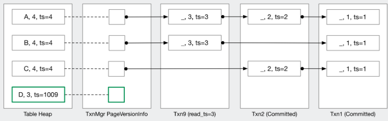

我们提供了辅助函数 `UpdateTupleInPlace` 和 `UpdateUndoLink` 来分别更新 table heap 中的元组和 undo link。这些函数模拟原子 compare-and-swap（比较并交换）操作，你需要提供一个 `check` 函数。这两个函数的伪代码如下：

```c++
UpdateUndoLink(rid, new_undo_link, check_function) {
  take the table heap lock / undo link lock
  retrieve the data from table heap / undo link
  call user-provided check function, if check failed, return false
  update the data and return true
}
```

本任务的所有测试用例都是单线程的，因此你可以简单地将 `nullptr` 传递给 `check` 参数以跳过检查，并分别使用 `UpdateTupleInPlace` 和 `UpdateUndoLink`。对于未来的并发测试用例，你需要**原子地**获取/更新 `Tuple` 和 `UndoLink`，以便其他事务无法更改另一个事务的中间结果。考虑以下场景：

1. `txn1` 调用 `GetTuple` 检查是否可以更新元组。
2. `txn2` 修改了元组及其 `UndoLink`。
3. `txn1` 然后调用 `GetUndoLink` 并获取了错误的 `UndoLink`。
4. `txn1` 基于错误的信息更新了元组和 `UndoLink`。

在这个例子中，你可能希望使用 `UpdateTupleAndUndoLink` 和 `GetTupleAndUndoLink` 来原子地获取/设置 (`src/concurrency/transaction_manager_impl.cpp`)。从 [Task 4.2](https://www.qianwen.com/chat/28b9e3afd7774017898851a1ebc89334#42-index-scan-delete--update) 开始，当多个线程并发更新元组及其 metadata / `UndoLink` 时，你可能需要实现 `check` 逻辑来检测 write-write conflicts（写写冲突）。

### **3.2 Commit (提交)**

一次只允许一个事务执行 `Commit` 函数，你应该通过使用事务管理器中的 `commit_mutex_` 来确保这一点。在本任务中，你需要使用事务提交逻辑扩展你在事务管理器中的 `Commit` 实现。以下是一些粗略的伪代码：

1. 获取 commit mutex。
2. 获取 commit timestamp（你可能需要在这里执行 `.load() + 1` 而不是 `.fetch_add(1)`，结合 `Begin` 思考一下为什么）。
3. 遍历此事务修改过的每个元组（通过 write set），并将 base tuples 的时间戳设置为 commit timestamp。你需要在所有修改执行器（insert, update, delete）中维护 write set。
4. 将事务状态设置为 `COMMITTED`。
5. 更新事务的 commit timestamp。
6. 更新 `last_committed_ts_`（你可以在这里执行 `.fetch_add(1)`）。

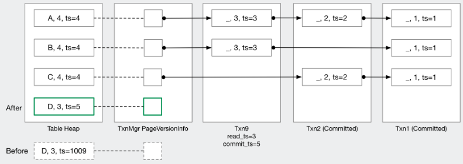

你应该已经作为 task 1 的一部分实现了上述大部分逻辑，所以你只需要添加遍历表的逻辑。

#### `TxnMgrDbg`

此时，我们**强烈建议**你实现调试函数 `TxnMgrDbg`。它应该打印出 table heap 的内容和每个元组的版本链。如果你来找我们时没有写好这个函数，我们会要求你先实现它。

我们的测试用例将在每个重要操作后调用你的调试函数，你可以打印任何你想检查版本链的内容。这个调试函数在调试你未来测试的实现时将**极其有用**。我们的参考解决方案中有一个调试函数示例，在 [BusTub Web Shell](https://15445.courses.cs.cmu.edu/fall2025/bustub/) 中运行，命令为 `\dbgmvcc {table_name}`（你可以通过按 F12 在 Chrome 上找到开发者控制台）。

我们的调试函数比你的需要更美观。你的版本可以像这样（取自 txn_scan_test 中的 CollectUndoLogTest）：

```
RID=0/0 ts=1 tuple=(1, 1.000000, <NULL>)
RID=0/1 ts=2 tuple=(2, 2.000000, <NULL>)
  txn1@0 (1, 1.000000, _) ts=1
RID=0/2 ts=3 tuple=(3, 3.000000, <NULL>)
  txn3@0 (2, 2.000000, _) ts=2
  txn1@1 (1, 1.000000, _) ts=1
RID=0/3 ts=3 tuple=(3, 3.000000, <NULL>)
RID=0/4 ts=4 tuple=(4, 4.000000, <NULL>)
  txn4@0 (3, 3.000000, _) ts=3
RID=0/5 ts=4 <del marker> tuple=(2, 2.000000, <NULL>)
  txn4@1 (2, 2.000000, _) ts=2
RID=0/6 ts=4 tuple=(4, 4.000000, <NULL>)
  txn4@2 <del> ts=2
  txn1@2 (1, 1.000000, <NULL>) ts=1
RID=0/7 ts=txn2 tuple=(100, 100.000000, <NULL>)
RID=0/8 ts=txn2 tuple=(100, 100.000000, <NULL>)
  txn2@0 (1, 1.000000, _) ts=1
RID=0/9 ts=txn5 tuple=(400, 400.000000, <NULL>)
  txn5@0 (4, 4.000000, _) ts=4
  txn1@3 (1, 1.000000, _) ts=1
```

在 BusTub Web Shell 上，`\dbgmvcc` 看起来像这样：

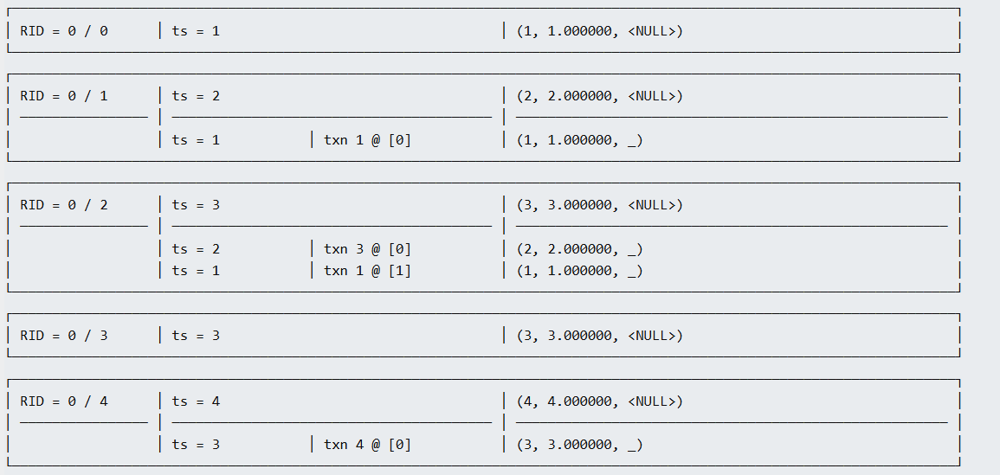

#### **Interactive Testing (交互式测试)**

以下是使用 [BusTub Web Shell](https://15445.courses.cs.cmu.edu/fall2025/bustub/) 将你的实现与我们的实现进行比较的示例。

```bash
make -j`nproc` shell && ./bin/bustub-shell
bustub> CREATE TABLE t1(v1 int, v2 int);
bustub> INSERT INTO t1 VALUES (1, 1), (2, 2), (3, 3);
bustub> \dbgmvcc t1 -- call your `TxnMgrDbg` function to dump the version chain
bustub> BEGIN;
txn?> INSERT INTO t1 VALUES (4, 4);
txn?> \txn -1
bustub> SELECT * FROM t1; -- the newly-inserted row should not be visible to other txns
bustub> \txn ? -- use the id you see before
txn?> COMMIT;
```

你也可以使用 BusTub Netcat shell 启动带有事务的交互式会话。（你需要安装 `nc` (netcat) 才能使用此交互式 shell）。

```bash
make -j`nproc` nc-shell && ./bin/bustub-nc-shell
bustub> CREATE TABLE t1(v1 int, v2 int);
bustub> INSERT INTO t1 VALUES (1, 1), (2, 2), (3, 3);
bustub> \dbgmvcc t1 -- call your `TxnMgrDbg` function to dump the version chain
# in another terminal
nc 127.0.0.1 23333
bustub> INSERT INTO t1 VALUES (4, 4);
# in yet another terminal
nc 127.0.0.1 23333
bustub> SELECT * FROM t1; -- the newly-inserted row should not be visible to this txn
bustub> COMMIT;
```

我们在 [BusTub Web Shell](https://15445.courses.cs.cmu.edu/fall2025/bustub/) 中提供了在浏览器中运行的参考解决方案。

从本任务开始，我们所有的测试用例都是用 SQL 编写的。只要你的 SQL 查询结果与参考输出匹配，你就能获得该测试用例的满分。我们不检查你版本链的确切内容，但我们会检查 `UndoLog` 的数量和 table heap 元组的数量，以确保你正确且高效地维护版本链。我们还将使用你的 `ReconstructTuple` 来验证你生成的 `UndoLog` 的正确性。

### **3.3 Generate Undo Log (生成 Undo Log)**

在实现 update 和 delete 执行器之前，你需要实现 `GenerateNewUndoLog` 和 `GenerateUpdatedUndoLog`。给定原始的 base tuple 和修改后的 target tuple，你应该返回应存储在进行修改的事务中的 `UndoLog`。

确保你理解 `GenerateNewUndoLog` 和 `GenerateUpdatedUndoLog` 之间的区别。假设一个事务多次更新一个元组。我们期望在特定事务内，每次更新只有一个 `UndoLog`。`GenerateNewUndoLog` 用于每个元组的**第一次**修改。之后，使用 `GenerateUpdatedUndoLog` 将修改合并到一个 `UndoLog` 中。

需要考虑三种情况：

1. **Update (更新):** 在这种情况下，基于 base tuple 和 target tuple 生成 `UndoLog`。如果这不是该事务内的第一次更新，请通过 `GenerateUpdatedUndoLog` 将其与原始 `UndoLog` 合并。一个事务每个 RID 最多只能持有一个 undo log。如果一个事务需要两次更新一个元组，它应该只更新 base tuple 及其当前的 undo log。
2. **Delete (删除):** 在这种情况下，你需要在 `UndoLog` 中存储整个元组，以便可以重构整个元组。思考一下如何在事务内进行多次修改时实现这一点。
3. **Insert (插入):** 你在 Task 3.1 中实现的插入总是使用新的 RID 在 table heap 中创建一个新元组。换句话说，你**永远不需要**为插入操作生成 `UndoLog`。然而，在 Task 4.2 中，你可能需要将一个元组插入回一个已删除的元组中。当 `base_tuple` 是 `nullptr` 时，你就知道这是一个 insert 情况。

在计算 `UndoLog` 时，你会发现 `Tuple::IsTupleContentEqual` 和 `Value::CompareExactlyEquals` 很有用。

### **3.4 Update & Delete Executor (更新与删除执行器)**

在本任务中，你需要实现实际生成 `UndoLog` 并更新 table heap base tuples 的逻辑。update 和 delete 执行器非常相似。

在更新或删除元组之前，你需要检查 **write-write conflicts（写写冲突）**。有几种情况需要注意。如果一个元组正被一个未提交的事务修改，则不允许其他事务修改它。如果他们这样做，就会发生写写冲突，与先前事务冲突的事务应该被中止（aborted）。另一种写写冲突的情况是：事务 A 删除了一个元组并提交，而在事务 A 提交后，在 A 之前开始的事务 B 删除了同一个元组。当检测到写写冲突时，事务状态应设置为 `TAINTED`，你需要抛出一个 `ExecutionException` 以将 SQL 语句标记为失败。如果发生 execution exception，`ExecuteSqlTxn` 将返回 `false`。此时，我们不要求你实现实际的中止逻辑。本任务的测试用例不会调用 `Abort` 函数。
	
你的 update executor 应该实现为 **pipeline breaker（流水线中断器）**：它应该首先将子执行器的所有元组存储到本地缓冲区，然后再写入任何更新。之后，它应该从本地缓冲区拉取元组，计算更新后的元组，然后在 table heap 上执行更新。

此时，所有测试用例都是单线程的，因此你不需要费力思考更新/删除过程中可能发生的竞争条件（race conditions）。检测写写冲突的唯一条件是检查 base tuple metadata 的时间戳。

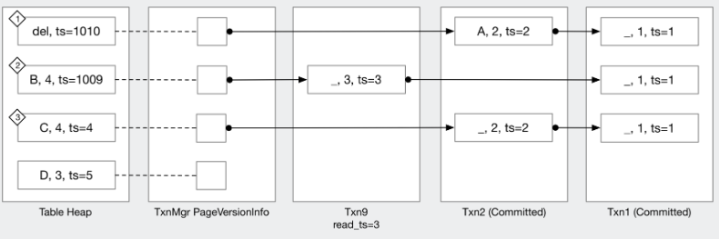

让我们过一遍上面的例子，它展示了你在进行任何更改前需要处理的 3 种不同情况。

- 在情况 (1) 中，`txn10` 删除了 (A, 2) 元组且尚未提交。假设 `txn9` 的 read timestamp 为 3。`txn9` 仍然可以读取该元组的旧版本 (A, 2)。
- 在情况 (2) 中，如果除 `txn9` 之外的任何其他事务尝试更新/删除这个 B 元组，它们将需要中止。例如，如果 `txn10` 最终需要更新/删除该元组，`txn10` 应该因写写冲突而被中止。
- 在情况 (3) 中，有另一个事务将 (C, 2) 更新为 (C, 4)，commit timestamp 为 4。`txn9` 可以读取元组的旧版本 (C, 2)。同样，如果 `txn9` 最终需要更新/删除该元组，`txn9` 应该因写写冲突而被中止，因为在事务 read timestamp 之后发生了更新的更新。

还有第 4 种情况，即事务想要更新它自己做出的修改（self modification / 自身修改）。如果一个元组已经被当前事务修改过，你**不应**将其视为写写冲突。

在检查了写写冲突（你应该为此编写一个辅助函数）之后，你可以继续实现更新/删除逻辑：

1. 通过 `GenerateNewUndoLog` 或 `GenerateUpdatedUndoLog` 创建修改的 undo log。
2. 更新元组的 next undo link 以指向新的 undo log。
3. 更新 table heap 中的 base tuple 和 metadata（这一步可以使用 `UpdateTupleAndUndoLink` 与上一步原子地完成）。

这里是对删除的解释：
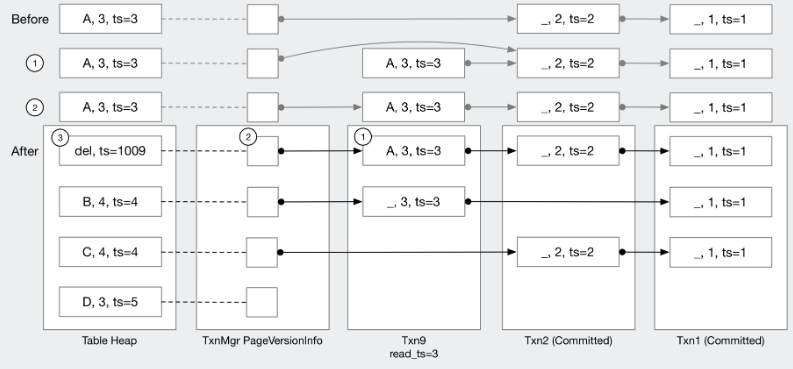

这里是对更新的解释

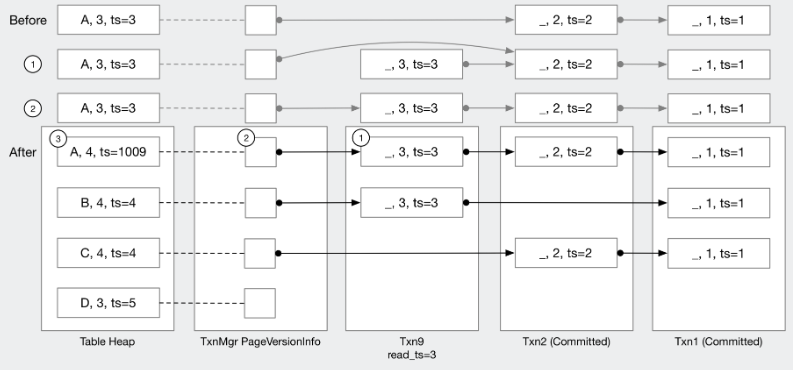

在开始实现执行器之前，请确保你理解了这些图。如果有任何问题，请向我们寻求澄清！

在下面的例子中，`txn9` 首先将元组更新为 (A, 4)，然后到 (A, 5)，然后到 (B, 5)，然后到 (A, 5)，最后删除它。在整个过程中，`txn9` 为该元组**精确地保留一个** `UndoLog`。当我们将 (B, 5) 更新为 (A, 5) 时，我们本可以一路回到事务的开始来计算部分更新 (_, 5)（因为组合所有的 deltas 会让你从 (A,3) 变到 (A, 5)）。然而，我们建议**简单地将修改添加到现有的 `UndoLog` 中**（使其具有完整的更改 (A, 5)），这将使处理并发问题变得更容易。换句话说，确保你只在 undo log 中添加/更新数据，而**不要移除数据**。

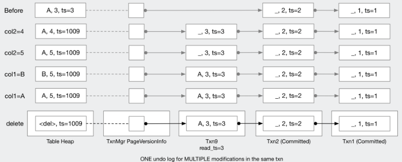

在下一个例子中，`txn9` 插入一个元组，进行多次修改，然后将其删除。在这种情况下，你可以直接修改 table heap 元组而**无需生成任何 undo logs**。

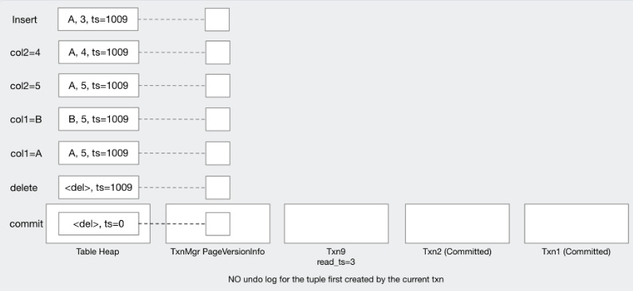

我们在末尾将 commit timestamp 设置为 0，因为这个元组是由 `txn9` 插入并由 `txn9` 删除的，这意味着它**从未真正存在过**。如果版本链确实包含 undo logs，它应该被设置为实际的 commit timestamp 而不是 0，以便具有较低 read timestamp 的事务可以访问 undo logs。你也可以直接忽略这种情况并遵循通常的 commit 逻辑。只要你能在每个时间戳读取正确的数据，这在 [Task #4.4](https://www.qianwen.com/chat/28b9e3afd7774017898851a1ebc89334#44-serializable-verification) 之前都不重要。

在本项目中，我们将始终使用固定大小的类型，因此 `UpdateTupleInPlace` 应该始终成功而不会抛出异常。

将 update / deletes 的所有内容整合在一起，你应该：

1. 从子执行器获取 RID。
2. 生成更新后的元组。
3. 对于自身修改（self-modification），更新 table heap 元组，以及当前事务中的 undo log（如果有的话，可选）。
4. 否则，生成 undo log，并将它们链接在一起。

此时，除了垃圾回收测试用例之外，你应该能通过 `TxnExecutorTest` 中的所有测试。

### **Task 3.5 Stop-the-world Garbage Collection (全局暂停垃圾回收)**

在我们给你的代码中，一旦我们将事务添加到事务 map 中，我们就永远不会移除它。我们这样做是因为具有较低 read timestamp 的事务可能需要读取存储在先前已提交或已中止事务中的 undo logs。然而，想象一下如果我们已经有了数千甚至数百万个事务。很可能许多过去的事务已经被更新的事务完全覆盖，我们不再需要存储它们的 undo logs。在本任务中，你需要实现一个简单的垃圾回收策略来移除未使用的事务。

当调用 `GarbageCollection` 时手动触发垃圾回收。测试用例只会在所有事务暂停时调用此函数。因此，在进行垃圾回收时你不需要太担心竞争条件。在 [Task 1](https://www.qianwen.com/chat/28b9e3afd7774017898851a1ebc89334#12-watermark) 中，你已经实现了一个计算 watermark（系统中最低的 read timestamp）的算法。在本任务中，你需要**移除所有不包含对具有最低 read timestamp 的事务可见的任何 undo logs 的事务**。

你需要遍历 table heap 和版本链，以识别具有最低 read timestamp 的事务仍然可以访问的 undo logs（确保你理解这一点：对该事务不可见的 undo log 对所有事务都不可见）。如果一个事务已提交/中止，并且不包含对具有最低 read timestamp 的事务可见的任何 undo logs，你可以简单地将其从事务 map 中移除。

下面的例子说明了 watermark timestamp 为 3 且 `txn1`、`txn2` 和 `txn9` 已提交的情况。`txn1` 的 undo logs 不再可访问，因为每个 commit timestamp 为 1 的 undo log 都被 commit timestamp 小于或等于 3 的更新覆盖了。因此我们可以直接移除 `txn1`。`txn2` 针对元组 (A, 2) 的 undo log 不可访问，但其针对元组 (C, 2) 的 undo log 仍然可访问，因为没有额外的更新，所以我们现在不能移除它。

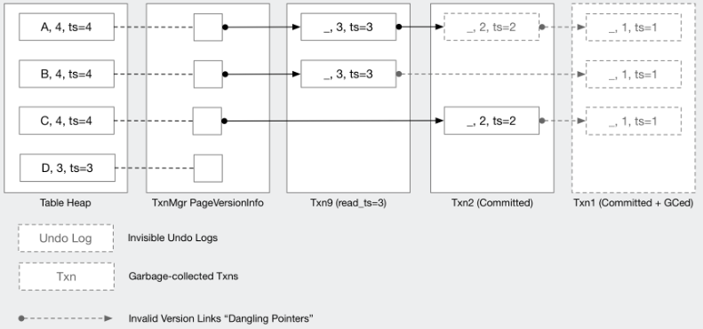

移除 `txn1` 后，将会有指向已移除 undo log 的悬空指针（dangling pointers），如虚线所示。你**不需要**更新先前的 undo log 来修改悬空指针并使其成为无效指针，在本项目中将其留在那里是可以的。如果你的实现中一切都是正确的，你的顺序扫描执行器甚至不应该尝试解引用这些悬空指针，因为它们低于 watermark。但是，我们仍然建议你在代码中添加一些 asserts 以确保这永远不会发生。

此时，你应该能通过 `TxnExecutorTest`。

### **3.6 Abort (中止)**

在本任务之前，进入 `TAINTED` 状态的事务会导致其他事务在写冲突的元组上中止。在本任务中，你需要实现 abort 逻辑，以便当任何事务中止时我们可以继续修改元组。回想一下，我们通过检查元组是否正在进行修改来检测写写冲突。当中止一个事务时，我们应该**撤销（revert）** 此更改，以便其他事务可以写入该元组。
你可以选择在本任务中实现哪种设计。
**Implementation #1 (实现 #1)**
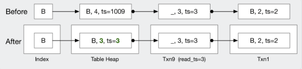
在这个例子中，我们将中止 `txn9`。你可以简单地撤销元组并将 table heap 设置为原始值。这更容易实现，并会使你的版本链留下两个时间戳为 3 的项目。你的顺序扫描/索引扫描执行器应该在事务中止后正确处理这种情况。
使用这种实现，中止的事务将在版本链中包含 undo logs，并且无法在垃圾回收中立即回收。
**Implementation #2 (实现 #2)**
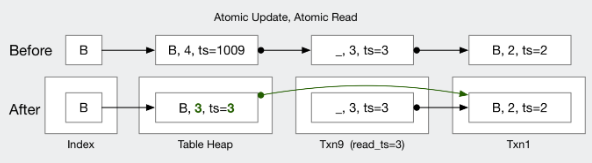
在这个例子中，中止 `txn9` 将原子地将 undo link 链接到前一个版本并更新 table heap。你需要使用 `UpdateTupleAndUndoLink / GetTupleAndUndoLink` 来原子地更新/读取元组和 undo links。使用这种实现，你不需要等到 watermark 才能从中止的事务 map 中移除该事务。
如果事务插入了一个没有 undo logs 的全新元组，abort 过程只需将其设置为 `ts = 0` 的 deletion marker（删除标记）。BusTub 中的 commit timestamp 从 1 开始，因此将其设置为 0 是安全的。
你**不需要**撤销索引修改。添加到索引中的任何内容都将保留在那里且不会被移除。你也**不需要**实际从 table heap 中移除元组。如果你需要撤销插入，只需将其设置为 deletion marker。
你应该允许多个线程并行中止。也就是说，在整个函数中**不要**获取 `commit_mutex` 或任何其他锁。

------

## **Task #4 - Primary Key Index (主键索引)**

BusTub 支持主键索引，可以通过以下方式创建：

```sql
CREATE TABLE t1(v1 int PRIMARY KEY);
CREATE TABLE t1(v1 int, v2 int, PRIMARY KEY(v1, v2));
```

当在 `CREATE TABLE` 语句中指定主键时，BusTub 将自动创建一个 `is_primary_key` 属性设置为 `true` 的索引。在 BusTub 中，一个表最多只能有一个主键索引。主键索引确保主键的唯一性。在本任务中，你需要在你的 MVCC 执行器中处理主键索引。测试用例**不会**使用 `CREATE INDEX` 创建二级索引（secondary indexes），因此你不需要在本任务中维护二级索引。

### **4.1 Index Insert (索引插入)**

你需要修改你的 insert executor 以正确处理主键索引。同时，你还需要考虑多个事务从多个线程插入相同主键的情况。插入索引可以通过以下步骤完成：

1. 首先，检查元组是否已存在于索引中。如果存在，

   abort

   \* 该事务。

   - *这仅适用于 [Task 4.1](https://www.qianwen.com/chat/28b9e3afd7774017898851a1ebc89334#41-index-insert)。如果你打算实现 [Task 4.2](https://www.qianwen.com/chat/28b9e3afd7774017898851a1ebc89334#42-index-scan-delete--update)，那么索引可能指向一个已删除的元组，在这种情况下，你**不应该**中止。
   - 你只需要在 [Task 4](https://www.qianwen.com/chat/28b9e3afd7774017898851a1ebc89334#task-4---primary-key-index) 中将事务状态设置为 `TAINTED`。`TAINTED` 意味着事务即将被中止，但数据尚未被清理。在 [Task #3.6](https://www.qianwen.com/chat/28b9e3afd7774017898851a1ebc89334#36-abort) 之前，你不需要实现实际的 abort 过程。tainted 事务会在 table heap 中留下一些元组，你不需要清理它。当另一个事务插入到同一位置并检测到写写冲突时，它仍应被视为冲突。将事务设置为 `TAINTED` 状态后，你还需要抛出一个 `ExecutionException`，以便 `ExecuteSql` 返回 `false` 且测试用例知道事务/SQL 已被中止。

2. 接下来，在 table heap 上创建一个具有临时事务时间戳的元组。

3. 之后，将元组插入索引。如果违反唯一键约束，你的索引应返回 `false`。

在步骤 (1) 和 (3) 之间，其他事务有可能正在做同样的事情。在当前事务创建之前，索引中可能会创建一个新条目。在这种情况下，你将需要中止该事务，并且 table heap 中将会有一个不被索引中任何条目引用的元组。

在这个例子中，让我们看看 `txn9` 尝试分别插入 A、B 和 C（假设元组的唯一列是主键）。假设 A 已存在于索引中，而 C 已被一个未提交的事务插入。为了清晰起见，我们移除了图中的 `PageVersionInfo` 结构。

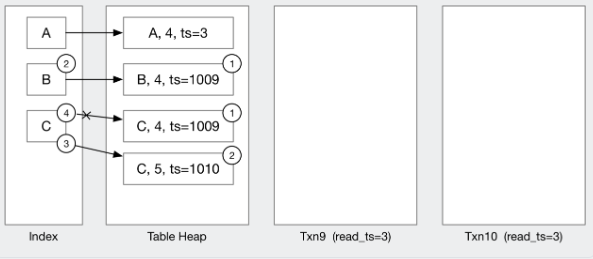

- **Inserting A:** 键已存在于索引中，违反了主键的唯一性要求，因此中止事务。
- **Inserting B:** 由于索引中没有冲突，首先在 table heap 中创建一个元组，然后将新创建元组的 RID 插入索引。
- **Inserting C:** 我们假设这里有另一个 `txn10` 也试图插入 C。`txn9` 首先检测到索引中没有冲突并在 table heap 中创建一个元组。然后，在后台，`txn10` 执行 (2) 和 (3)，创建一个元组并更新索引。当 `txn9` 在步骤 (4) 尝试插入索引时，索引将报告唯一键冲突，因此 `txn9` 应进入 `TAINTED` 状态。

此时你**不需要**实现 MVCC 索引扫描执行器。我们的测试用例将使用范围查询（range queries）而不是等值查询（equal queries），以避免调用顺序扫描到索引扫描的规则，这样顺序扫描就不会被转换为索引扫描。

完成此操作后，你应该能通过本项目中的第一个并发测试用例，我们在此测试当多个线程插入相同键时你的实现是否正常工作。

### **4.2 Index Scan, Delete, & Update (索引扫描、删除与更新)**

在本任务中，你需要为 delete 和 update 执行器以及 MVCC 索引扫描执行器添加索引支持。

一旦在索引中创建了条目，它将**始终指向相同的 RID**，并且**即使元组被标记为删除也不会被移除**。我们这样做是为了让较早的事务仍然可以使用索引扫描执行器访问历史记录。为了支持这一点，你需要重新审视你的 insert executor。考虑 insert executor 插入到一个已被 delete executor 移除的元组的情况。你的实现应该**更新已删除的元组**而不是创建新条目，因为索引条目一旦创建就始终指向相同的 RID。你需要正确处理写写冲突检测和唯一约束检测。

在这个例子中，元组 (B, 2) 已被 commit timestamp 为 3 的事务删除。当元组被删除时，我们**不会**从索引中移除条目，因此索引可能指向 deletion marker，并且一旦存在就**始终**指向相同的 RID。当 `txn9` 使用 insert executor 将 (B, 3) 插入表中时，它**不应该**创建新元组。相反，它应该将 deletion marker 更新为插入的元组，就像这是一次 update 一样。

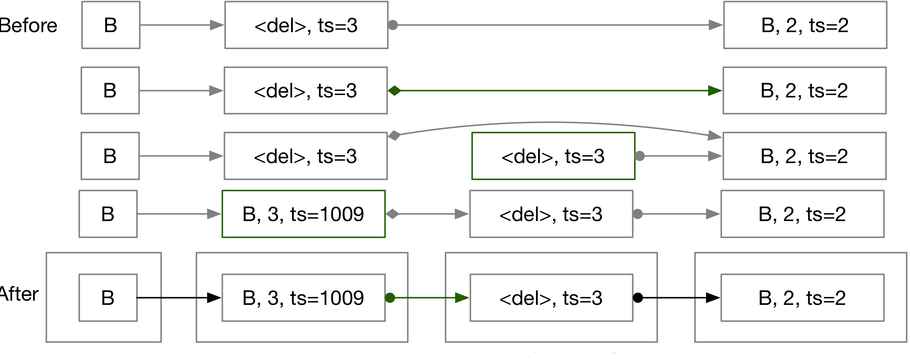

此时你还需要考虑其他竞争条件。例如，如果多个事务同时更新 `UndoLink`。你应该正确地中止其中一些事务，并让其中一个确切地继续执行而不丢失任何数据。从本任务开始，你需要使用原子辅助函数 `UpdateTupleAndUndoLink/GetTupleAndUndoLink` 并传入 `check` 函数以避免竞争条件。

你应该在上面的例子中观察到，会有一小段时间 table heap 包含一个与第一个 undo log 具有相同时间戳的（已删除）元组。在你实现了 updates 和 deletes 之后，你的顺序扫描执行器也应该正确处理这种情况。

### **4.3 Primary Key Updates (主键更新)**

你需要处理主键被更新的情况。在这种情况下，update 应该被实现为对原始键的 **delete** 和对新键的 **insert**。

让我们看看 `txn9` 按顺序执行 `UPDATE table SET col1 = col1 + 1` 的情况，其中 `col1` 是主键。

`txn9` 首先将 (2, B)（以及任何具有新主键的元组）插入表中。

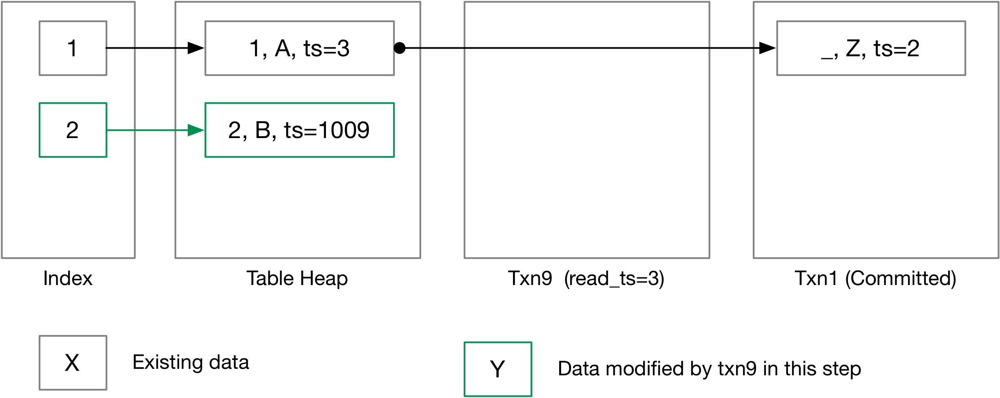

现在我们从 `col1 = col1 + 1` 开始更新表，删除所有将被更新的元组。

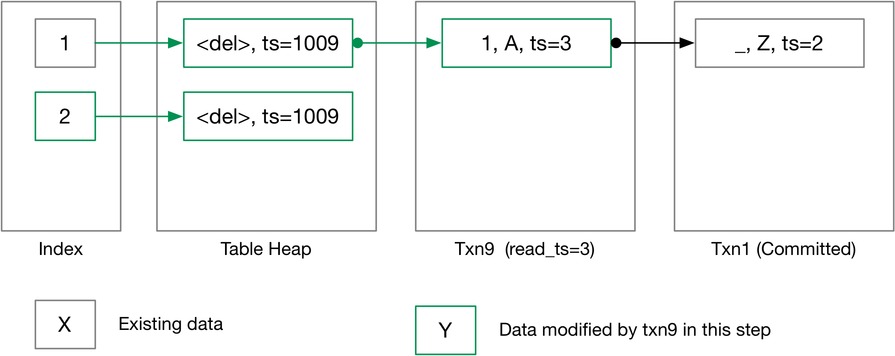

接下来，我们将更新后的元组使用新主键插入回表中。

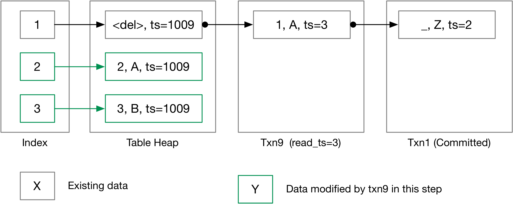

最后，我们提交更改。


这就是全部了！

### **4.4 Serializable Verification (可串行化验证)**

如果事务在 serializable 隔离级别下运行，你需要在提交事务时验证它是否满足可串行化。我们使用 **OCC backward validation（OCC 后向验证）** 进行可串行化验证。我们在课堂上讨论的验证方法仅适用于静态数据库。在 BusTub 中，你需要考虑新插入和删除的记录。为了完成可串行化验证，你需要在每次调用顺序扫描执行器或索引扫描执行器时，将 scan filter（即 scan predicate / 扫描谓词）存储在事务中。你还需要正确跟踪 write set。有了所有这些信息，我们可以通过检查 scan predicate（read set）是否与在当前事务开始之后开始的事务的 write set 相交来进行可串行化验证，如下所示，当我们提交一个事务时：

1. 你不需要验证只读事务。

2. 收集所有在当前事务 read timestamp 之后提交的事务。我们称这些为“冲突事务（conflict transactions）”。

3. 收集被冲突事务修改的所有 RID。

4. 对于每个元组，遍历其版本链以验证当前事务是否读取了任何“幻象（phantom）”。你可以收集直到事务 read timestamp 的所有 undo logs。然后，逐个重放它们以检查交集。

5. 对于版本链中的每次 update：

   - 对于 **insert**，你应该检查新元组是否满足当前事务的任何 scan predicates。如果是，abort。

   - 对于 

     delete

     ，你应该检查被删除的元组是否满足当前事务的任何 scan predicates。如果是，abort。

     - *存在一种边缘情况：事务插入然后删除一个元组，这在 table heap 中留下一个 delete marker。这应该被视为 no-op 而不是 delete。*

   - 对于 

     update

     ，你应该检查“before image（前像）”和“after image（后像）”。如果它们中的任何一个与当前事务的任何 scan predicates 重叠，abort。

     - *考虑事务修改一个元组然后将其恢复的情况，这会留下一个将某些列更新为相同值的 undo log。在这种情况下，你仍应将其作为 identical update（相同更新）处理而不是忽略它，并在必要时中止事务。*
     - *然而，如果有两个事务，第一个将值从 X 修改为 Y，然后第二个将 Y 修改为 X，如果存在一个在 txn1 开始前开始并在 txn2 提交后提交的 txn3，你仍然应该检测到 X 被更改的冲突。*

如果事务在 commit 阶段需要被中止，你应该直接执行 abort 逻辑来撤销更改，并将事务状态设置为 `ABORTED` 而不是 `TAINTED`。

这种验证方法效率低下，因为 (1) 只有一个事务可以进入验证过程 (2) 我们循环遍历所有可能冲突事务的 write sets 并在其上评估 scan predicates。你可以考虑在排行榜测试中实现并行验证或 precision locking（精度锁定，属性级别检查而不是检查记录）。

要使用 BusTub shell 测试你的实现：

```bash
./bin/bustub-shell
bustub> set global_isolation_level=serializable;
```

对于 BusTub Netcat shell：

```bash
./bin/bustub-nc-shell --serializable
```

------

## **Leaderboard Benchmark - T-NET, the Terrier NFT Exchange Network (排行榜基准测试 - T-NET，梗犬 NFT 交换网络)**

在一个遥远的星系，有一个宇宙，[Jack Russell terriers（杰克罗素梗）](https://en.wikipedia.org/wiki/Jack_Russell_Terrier) 生活在一个高度文明的社会中。我们说这个社会高度文明，除了 NFT（非同质化代币）正变得越来越受欢迎。有一天，梗犬们决定寻找一个数据库系统来追踪他们的 NFT，而 BusTub 是他们的候选系统之一。

### **Benchmark #1 - Token Transfer over T-NET / Snapshot Isolation (T-NET 上的代币转移 / 快照隔离)**

梗犬通过 T-NET 转移他们的 NFT。T-NET 的工作方式类似于银行转账：一只梗犬可以发起将一定数量的 NFT 转移给另一只梗犬。对于此场景，事务将在 snapshot isolation 模式下运行。

```sql
CREATE TABLE terriers(terrier int primary key, token int);
-- each transaction: transfer A tokens from X to Y
UPDATE terriers SET token = token + A WHERE terrier = X;
UPDATE terriers SET token = token - A WHERE terrier = Y;
```

### **Benchmark #2 - Trading-Network over T-NET / Serializable (T-NET 上的交易网络 / 可串行化)**

在 T-NET 上转移 NFT 时，梗犬将被收取转账费。如果两只梗犬在同一个交易网络中，转账费将被免除。网络由一个整数 ID 表示。

```sql
CREATE TABLE terriers(terrier int primary key, token int, network int);
-- each transaction: transfer A tokens from X to Y
X_network = SELECT network FROM terriers WHERE terrier = X;
Y_network = SELECT network FROM terriers WHERE terrier = Y;
UPDATE terriers SET token = token + A * 0.97 WHERE terrier = X; -- if X_network != Y_network
UPDATE terriers SET token = token + A WHERE terrier = X; -- if X_network == Y_network
UPDATE terriers SET token = token - A WHERE terrier = Y;
```

同时，梗犬可以通过注册奖金邀请其他人加入他们的网络：

```sql
-- X invites Y to join the network
A = SELECT network FROM terriers WHERE terrier = X;
UPDATE terriers SET network = A, token = token + 1000 WHERE terrier = Y;
```

梗犬还可以通过网络注册费启动他们自己的网络。

```sql
-- X starts a new trading network
UPDATE terriers SET network = ?, token = token - 1000 WHERE terrier = X;
```

此基准测试中的所有事务都将在 serializable 级别运行。

*由于 T-NET 的工作方式，梗犬有可能拥有负数的 NFT。*

你可能需要在顺序扫描运行时或在事务 commit / abort 时实现更细粒度的垃圾回收。排行榜测试**不会**调用你在 [Task 3](https://www.qianwen.com/chat/28b9e3afd7774017898851a1ebc89334#task-35-stop-the-world-garbage-collection) 中实现的 stop-the-world 垃圾回收器。我们的一些测试用例需要在 commit 后访问 `commit_ts`，因此在进行细粒度垃圾回收时，你可以清除 undo buffer 而不是从事务 map 中移除事务（而不是像 stop-the-world 垃圾回收那样移除它）。

实现更高效的可串行化验证（例如 [precision locking](https://dl.acm.org/doi/10.1145/582318.582340)）可能对排行榜基准测试有所帮助。实现并行的可串行化验证也可能有所帮助。

你将分别根据**转移速度**和数据库系统的**空间使用量**进行排名。转移速度通过系统的吞吐量（throughput）衡量，空间使用量通过系统中表元组和 undo logs 的**总行数**衡量。将有一个后台线程定期收集系统中的行数，空间使用量通过整个基准测试期间**任何时间的最大行数**计算。最终的排行榜奖励分数计算为：`min{speed_rank_bonus+space_rank_bonus, leaderboard_maximum_bonus}`。对于每个排名，第 1 名将获得 25 分，第 2-10 名将获得 15 分，第 11-20 名将获得 5 分。

### **Leaderboard Policy (排行榜政策)**

带有排行榜奖励的提交需要接受 TA 的人工审查。

- 所谓“审查”，是指 TA 会手动查看你的代码，或者如果他们通过查看不确定某项优化是否正确，他们会对现有测试用例进行简单修改，以查看你的排行榜优化是否正确处理了你想要优化的特定情况。
  - *简单修改的一个例子：更改基准测试的 buffer pool manager 大小。*
- 你的优化不应影响正确性且应该是合理的。你可以针对特定情况进行优化，但它应该适用于你优化情况下的所有输入。
  - **Allowed (允许):** 仅处理 3-table join reordering（参见 Fall 2022 Project #3）。
  - **Allowed (允许):** 在 Project #2 中针对 leaf node size > 100 进行优化。
  - **Disallowed (不允许):** 将 plan 与排行榜测试进行比较，并在 Project #3 中将其转换为带有输出表的 ValueExecutor。那是因为你的优化应该适用于所有表内容。硬编码答案在某些情况下会产生错误结果。
- **不允许**为了让你的系统具有超低吞吐量同时具有低空间使用量（只有很少的更新）而阻塞（stall）系统。**不允许**使用全局锁来序列化所有事务以减少写写冲突的数量。我们将在基准测试结束时转储一些数据，TA 将查看数据以查找此类违规行为。你的性能应与参考解决方案相比合理，以获得空间使用量排名的奖励。
- 你不应该尝试通过使用副作用信息来检测你的提交是否正在运行排行榜测试。
  - *除非我们允许你这样做。*
  - **Disallowed (不允许):** 使用 `#ifdef NDEBUG` 等。
- 具有明显正确性问题的提交将不会被分配排行榜奖励。

如果你不确定某项优化是否合理，你应该在 Piazza 上发帖或访问任何 TA 的 office hour。

------

## **Instructions (说明)**

有关如何创建你的私有仓库和设置开发环境，请参阅 [Project #0 instructions](https://www.qianwen.com/project0/#instructions)。
你必须从上游 BusTub 仓库拉取本项目中我们提供的测试文件和其他补充文件的最新更改。

### **Formatting (格式化)**

你的代码必须遵循 [Google C++ Style Guide](https://google.github.io/styleguide/cppguide.html)。
我们使用 [Clang](https://clang.llvm.org/) 自动检查你的源代码质量。
如果你的提交未能通过这些检查中的任何一项，你的项目成绩将为零。

执行以下命令来检查你的语法。

- `format` 目标将自动修正你的代码。
- `check-lint` 和 `check-clang-tidy-p4` 目标将打印错误并指导你如何修复它以符合我们的风格指南。

```bash
$ make format
$ make check-lint
$ make check-clang-tidy-p4
```

### **Memory Leaks (内存泄漏)**

对于本项目，我们使用 [LLVM Address Sanitizer (ASAN) and Leak Sanitizer (LSAN)](https://clang.llvm.org/docs/AddressSanitizer.html) 来检查内存错误。要启用 ASAN 和 LSAN，请在 debug 模式下配置 CMake 并像往常一样运行测试。如果存在内存错误，你将看到内存错误报告。请注意，macOS 仅支持 address sanitizer 而不支持 leak sanitizer。

在某些情况下，address sanitizer 可能会影响调试器的可用性。在这种情况下，你可能需要通过使用以下命令配置 CMake 项目来禁用所有 sanitizers：

```bash
$ cmake -DCMAKE_BUILD_TYPE=Debug -DBUSTUB_SANITIZER= ..
```

### **Development Hints (开发提示)**

- 你可以在 debug 模式下使用 `BUSTUB_ASSERT` 进行断言。`BUSTUB_ASSERT` 中的语句在 release 模式下**不会**被执行。
- 如果你在所有情况下都有需要断言的内容，请改用 `BUSTUB_ENSURE`。
- 如果你遇到问题，我们鼓励你使用图形化调试器来调试你的项目。
- 如果你遇到编译问题，运行 `make clean` 并不能完全重置编译过程。你需要删除你的 build 目录并重新运行 `cmake ..`，然后再重新运行 `make`。
- 将你关于本项目的所有问题发布到 Piazza 上。**不要**直接通过电子邮件向 TA 提问。

------

## **Grading Rubric (评分标准)**

每个项目提交将根据以下标准进行评分：

- 提交是否成功执行所有测试用例并产生正确答案？
- 提交是否在执行时没有任何内存泄漏？
- 提交是否遵循代码格式化和风格政策？

**Points distribution (分数分布)**

- **Until task 4.1:** 如果你正确实现了 MVCC 协议，你将获得总共 75 分。在 75 分边界之前，只会有一个并发测试用例。
- **Task 4.2, 4.3, 4.4:** 为了进一步获得总共 100 分，你可能需要花费与完成 75 分边界所有任务一样多的时间。

*排行榜测试不允许迟交（Late days are not allowed for leaderboard tests）。*

## **Late Policy (迟交政策)**

请参阅 syllabus 中的 [late policy](https://www.qianwen.com/syllabus.html#late-policy)。

## **Submission (提交)**

完成作业后，你可以将你的实现提交到 Gradescope：
https://www.gradescope.com/courses/935004

在你的 `build/` 目录中运行 `make submit-p4` 将在你的项目根目录下生成一个名为 `project4-submission.zip` 的 `zip` 压缩包，你可以将其提交到 Gradescope。

**记得在提交前解决所有风格问题：**

```bash
make format
make check-clang-tidy-p4
```

## **Collaboration Policy (合作政策)**

- 每个学生必须**独立**完成此作业。
- 允许学生与他人讨论项目的高层次细节。
- 不允许学生在与其他学生进行小组会议后复制白板上的内容。
- 不允许学生复制同事的解决方案。

**WARNING (警告):** 本项目的所有代码必须是你自己的。你不得从其他学生或你在网上找到的其他来源复制源代码。抄袭将不被容忍。有关更多信息，请参阅 CMU 的 [Policy on Academic Integrity](https://www.cmu.edu/policies/student-and-student-life/academic-integrity.html)。